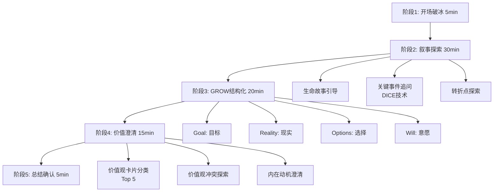

# Phase 2.1 个人画像问卷完整技术方案 v2.0

> **项目**: RAG 系统 - 个人历史画像深度采集
>
> **核心定位**: 一次性重要语录提取，初期设计至关重要
>
> **技术栈**: Vanilla JS + Express + SQLite + Ollama (qwen2.5:14b-instruct)
>
> **方法论**: 叙事访谈法 + GROW 模型 + 动机式访谈（混合式三阶段）
>
> **创建日期**: 2025-11-23 | **更新日期**: 2025-11-23 v2.0 | **维护者**: 壮爸

---

## 📋 目录

1. [核心设计理念](#核心设计理念)
2. [访谈方法论：三阶段框架](#访谈方法论三阶段框架)
3. [五阶段提问流程](#五阶段提问流程)
4. [三层数据架构](#三层数据架构)
5. [数据库Schema设计](#数据库schema设计)
6. [完整交互流程](#完整交互流程)
7. [API接口设计](#api接口设计)
8. [前端界面设计](#前端界面设计)
9. [AI服务设计](#ai服务设计)
10. [实施步骤](#实施步骤)

---

## 🎯 核心设计理念

### v2.0 重大升级

基于《个人历史画像深度采集方法论调研报告》，本版本采用业界最佳实践：

**v1.0（已废弃）**：
- ❌ 简化的"苏格拉底提问法"
- ❌ 两层数据库架构（user_profile + followup）
- ❌ 单一7B模型

**v2.0（当前）**：
- ✅ **三阶段访谈框架**：叙事访谈法 + GROW 模型 + 动机式访谈
- ✅ **10张表数据库**：完整的人格画像知识图谱
- ✅ **三层数据分离**：事实层/解释层/洞察层
- ✅ **统一14B模型**：qwen2.5:14b-instruct（推理能力+15%）
- ✅ **五阶段提问流程**：开场 → 叙事 → GROW → 价值 → 总结
- ✅ **DICE追问技术**：描述性/独特记忆/澄清性/解释性

---

### 设计原则

1. **一次性正确**：这是用户的重要语录，必须精准采集，避免后续频繁修改
2. **用户主导**：AI 辅助但不替代，用户保留最终决定权
3. **科学严谨**：基于心理学、教练技术、用户研究的成熟方法论
4. **三层分离**：区分"用户说了什么"（事实）vs"AI理解了什么"（解释）vs"深层模式"（洞察）
5. **Pip-Boy 主题贯穿**：所有界面统一使用 Pip-Boy CRT 风格
6. **关键词暂缓**：先验证核心流程，Phase 2.2 再补充关键词提取

---

## 🔬 访谈方法论：三阶段框架

### 为什么不使用单一方法？

| 方法 | 优势 | 劣势 | 结论 |
|------|------|------|------|
| **仅叙事访谈** | 故事丰富，语境完整 | 缺乏结构，难以系统提取特质 | ❌ 不足 |
| **仅GROW模型** | 结构化强，目标明确 | 忽略过去经验和价值观形成 | ❌ 不足 |
| **仅苏格拉底提问** | 深度追问，哲学性强 | 机械重复，缺乏同理心 | ❌ 不足 |
| **三阶段组合** | 开放探索 + 结构化 + 价值澄清 | 时长较长（70分钟） | ✅ 推荐 |

---

### 三阶段框架详解

```
┌──────────────────────────────────────────┐
│ 阶段 1：叙事探索（30 分钟）               │
│ - 方法：叙事访谈法                        │
│ - 目标：通过生命故事捕捉身份认同和价值观形成 │
│ - 输出：时间线、转折点、关键人物           │
└──────────────────────────────────────────┘
                 ↓ 过渡：从过去到现在/未来
┌──────────────────────────────────────────┐
│ 阶段 2：GROW 结构化（20 分钟）            │
│ - 方法：GROW 模型                        │
│ - 目标：系统覆盖目标、现实、选择、行动     │
│ - 输出：目标清单、优势识别、障碍分析       │
└──────────────────────────────────────────┘
                 ↓ 过渡：从行为到动机
┌──────────────────────────────────────────┐
│ 阶段 3：价值澄清（20 分钟）               │
│ - 方法：动机式访谈                        │
│ - 目标：深挖内在价值观和真实动机          │
│ - 输出：核心价值观、价值观冲突、内在动机   │
└──────────────────────────────────────────┘
                 ↓
         【完整的个人画像】
```

---

## 📝 五阶段提问流程

### 完整70分钟访谈流程



---

### 阶段 1：开场破冰（5 分钟）

**目标**：建立信任，说明访谈目的，降低用户防御心理

**核心话术**：
```
"今天我想深入了解你的故事，这些信息将帮助我更好地理解你，为你提供个性化的服务。

一切对话都是保密的，你可以随时选择不回答某些问题。这不是考试，没有对错之分，我只是想了解真实的你。"
```

**破冰问题**：
1. "在我们开始之前，你希望我怎样称呼你？"
2. "你现在心情如何？有什么想先聊的吗？"
3. "你对这次对话有什么期待吗？"

**AI 实现要点**：
- 温暖、好奇、值得信赖的语气
- 不要急于进入正式问题
- 给用户充分的心理准备时间

---

### 阶段 2：叙事探索（30 分钟）

**目标**：通过生命故事捕捉身份认同、价值观形成和核心体验

**提问策略**：
1. **开放式起始问题**（引发叙述）
2. **时间线追踪**（建立生命脉络）
3. **关键事件深挖**（捕捉转折点）
4. **情感体验探索**（理解主观意义）

**典型问题序列**：

| 提问目的 | 问题示例 | DICE 追问 |
|---------|---------|-----------|
| **生命故事引导** | "如果让你用 5 分钟讲述自己的故事，你会从哪里开始？" | D: "那天具体是什么时候？你在哪里？"<br/>I: "你当时在想什么？" |
| **童年经验** | "你记忆中最早的一件事是什么？" | D: "周围有谁？天气怎么样？"<br/>E: "那时你有什么感受？" |
| **成长转折** | "有没有某个时刻，你觉得自己'变成了现在的自己'？" | C: "你说的'变成了现在的自己'是指什么？"<br/>E: "是什么促成了那次改变？" |
| **重要关系** | "谁是对你影响最大的人？为什么？" | E: "他们教会了你什么？"<br/>I: "如果他们现在看到你，会说什么？" |
| **挫折经历** | "你经历过最大的挑战是什么？" | D: "具体发生了什么？"<br/>E: "你是如何度过的？" |
| **成就时刻** | "你最自豪的一件事是什么？" | E: "为什么这对你如此重要？"<br/>I: "那一刻你对自己说了什么？" |
| **价值观形成** | "有没有某个事件让你意识到'这就是我真正在乎的'？" | C: "你说的'真正在乎的'具体是指什么？"<br/>E: "那之后你的选择有什么不同吗？" |

---

### DICE 追问技术详解

这是本方案的核心追问技术，替代简单的"为什么"追问：

**D - Descriptive Detail Probes（描述性细节追问）**
- 目的：激活情境记忆，获得真实细节
- 示例：
  - "那天具体是什么时候？你在哪里？"
  - "周围有谁？天气怎么样？"
  - "你当时穿着什么？"

**I - Idiographic Memory Probes（独特记忆追问）**
- 目的：捕捉主观体验和意义构建
- 示例：
  - "你当时在想什么？"
  - "如果回到那一刻，你会对自己说什么？"
  - "那个经历如何改变了你？"

**C - Clarifying Probes（澄清性追问）**
- 目的：避免模糊表述，获得精确定义
- 示例：
  - "你说的'一切都变了'是指什么？"
  - "你提到的'自由'对你来说意味着什么？"
  - "能举个具体例子吗？"

**E - Explanatory Probes（解释性追问）**
- 目的：理解因果归因和自我解释
- 示例：
  - "为什么你觉得那是转折点？"
  - "你认为是什么导致了那个结果？"
  - "如果重来一次，你会做什么不同的选择？"

**AI 实现逻辑**：
```javascript
// 追问生成逻辑
function generateFollowup(userResponse, context) {
    if (userResponse.containsAbstractTerm()) {
        // 使用 C - Clarifying
        return `你说的'${term}'对你来说具体意味着什么？能举个例子吗？`;
    }

    if (userResponse.mentionsEvent()) {
        // 使用 D - Descriptive Detail
        return "当时的情境是怎样的？周围有谁？你在哪里？";
    }

    if (userResponse.showsEmotion()) {
        // 使用 I - Idiographic Memory
        return "听起来那段经历对你影响很深。你当时在想什么？";
    }

    if (userResponse.mentionsCause()) {
        // 使用 E - Explanatory
        return "你认为是什么导致了那个结果？";
    }
}
```

---

### 阶段 3：GROW 结构化（20 分钟）

**目标**：系统覆盖目标、现实、选择、行动四个维度

**GROW 模型详解**：

| GROW 维度 | 核心问题 | 深挖问题 | 提取目标 |
|----------|---------|---------|---------|
| **G - Goal（目标）** | "你现在最想实现的是什么？" | "如果 3 年后回头看，你希望自己达成了什么？" | 长期目标、理想状态 |
| | "成功对你来说是什么样子？" | "如果没有任何限制，你会做什么？" | 价值观对齐的愿景 |
| **R - Reality（现实）** | "你现在的状态是怎样的？" | "相比目标，你现在处于什么位置？" | 自我认知、现状评估 |
| | "你已经拥有哪些资源和优势？" | "有什么在阻碍你前进？" | 优势识别、障碍分析 |
| **O - Options（选择）** | "你有哪些选择？" | "如果不受现实限制，还有什么可能性？" | 思维模式、创造力 |
| | "你见过别人如何应对类似情况？" | "你最欣赏哪种解决方式？为什么？" | 榜样学习、价值判断 |
| **W - Will（意愿）** | "你最想从哪里开始？" | "什么会让你觉得'这一步值得'？" | 行动倾向、动力源 |
| | "你需要什么支持？" | "如果遇到困难，你会怎么办？" | 应对风格、韧性 |

**核心原则**：
- **开放性**：优先使用"什么""如何"而非"是否"
- **未来导向**：关注目标和可能性，而非问题
- **资源视角**：强调已有优势，建立信心

---

### 阶段 4：价值澄清（15 分钟）

**目标**：深挖内在价值观和真实动机，避免社会期待偏差

**价值观列表（50个）**：
```
自由、成就、关系、创造、安全、正义、健康、成长、
影响力、平衡、冒险、知识、美、和谐、自主、贡献、
乐趣、传统、地位、认可、诚实、家庭、稳定、挑战、
独立、归属、创新、责任、财富、权力、服务、探索、
完美、效率、多样性、友谊、爱、尊重、信任、忠诚、
勇气、同理心、智慧、幽默、耐心、宽容、谦逊、感恩、
奉献、简单
```

**核心问题序列**：

1. **价值观识别**：
   - "在这些价值观中，哪 5 个对你最重要？"
   - "如果只能选 3 个，你会选哪 3 个？"

2. **价值观定义**：
   - "为什么{value}对你如此重要？"
   - "{value}对你来说具体意味着什么？"

3. **价值观冲突**：
   - "有没有遇到过{value1}和{value2}冲突的情况？"
   - "你当时如何选择？现在回头看，你满意那个选择吗？"

4. **内在动机澄清**：
   - "你做这件事是因为你真的想做，还是因为应该做？"
   - "如果没有外部压力，你还会继续吗？"

**动机式访谈技巧**：
- 避免说教（"你应该..."）
- 避免引导性问题（"你是不是因为..."）
- 专注于"为什么"而非"是什么"
- 允许矛盾和悖论（"你说重视自由，但选择了稳定工作"）

---

### 阶段 5：总结确认（5 分钟）

**目标**：AI 总结关键洞察，用户确认准确性

**总结内容**：
1. **核心价值观**：识别出的 Top 3-5 价值观
2. **关键转折点**：影响最大的 2-3 个生命事件
3. **目标与愿景**：用户的长期目标和理想状态
4. **行为模式**：典型的决策模式和应对策略
5. **人格特质**：提取的核心特质（如：自主性强、持续成长导向）

**确认流程**：
1. AI 生成结构化总结
2. 用户阅读并标记：
   - ✅ 准确
   - ✎ 需要修改
   - ❌ 不准确
3. 用户可补充遗漏的重要信息
4. 最终版本经用户认可后存储

---

## 🗄️ 三层数据架构

### 核心理念

**问题**：如何区分"用户说了什么"和"AI 理解了什么"？

**解决方案**：三层数据分离

```
┌─────────────────────────────────────────┐
│  洞察层 (Insight Layer)                  │
│  - 抽象模式和深层理解                      │
│  - 例: "用户倾向于在不确定时寻求关系支持"   │
│  - Confidence: 0.6-0.8                  │
│  - 存储位置: insights 表 (layer='insight')│
└─────────────────────────────────────────┘
              ↑ 推断（AI 多条证据综合分析）
┌─────────────────────────────────────────┐
│  解释层 (Interpretation Layer)           │
│  - AI 的理解和归纳                        │
│  - 例: "用户重视自由，因为童年被过度管束"   │
│  - Confidence: 0.5-0.7                  │
│  - 存储位置: insights 表 (layer='interpretation')│
└─────────────────────────────────────────┘
              ↑ 归纳（AI 单次对话分析）
┌─────────────────────────────────────────┐
│  事实层 (Fact Layer)                     │
│  - 用户明确表达的内容                      │
│  - 例: "我大学毕业后辞职去旅行了一年"       │
│  - Confidence: 0.9-1.0                  │
│  - 存储位置: insights 表 (layer='fact')   │
└─────────────────────────────────────────┘
```

---

### 示例数据流

**用户回答**：
> "我大学毕业后没有立即工作，而是去旅行了一年。家人不理解，但我不后悔。"

**AI 三层提取**：

```json
// 事实层
{
  "layer": "fact",
  "content": "用户在大学毕业后辞职去旅行了一年",
  "evidence": "我大学毕业后没有立即工作，而是去旅行了一年。",
  "confidence": 1.0,
  "category": "turning_point"
}

// 解释层
{
  "layer": "interpretation",
  "content": "用户重视体验和自由胜过稳定和安全",
  "evidence": "选择旅行而非工作，且表示'不后悔'",
  "confidence": 0.7,
  "category": "value"
}

// 洞察层（需要多条证据支持）
{
  "layer": "insight",
  "content": "用户在重大决策时倾向于追随内心而非社会期待",
  "evidence": "旅行决定、拒绝家人期待、强调'不后悔'",
  "confidence": 0.8,
  "category": "behavior",
  "supporting_insights": [fact_id_1, interpretation_id_2]
}
```

---

### 置信度标准

| 层级 | 置信度范围 | 判断标准 | 示例 |
|------|-----------|---------|------|
| **事实层** | 0.9-1.0 | 用户明确表达 | "我在25岁时辞职了" |
| **解释层** | 0.5-0.7 | AI 单次对话归纳 | "用户重视自由" |
| **洞察层** | 0.6-0.8 | AI 多条证据综合分析 | "用户倾向于追随内心" |

**用户认可机制**：
- 所有层级的洞察都需要用户最终确认
- 用户可以：
  - ✅ 认可（直接存入 knowledge_base）
  - ✎ 修改（用户编辑后存入）
  - ❌ 拒绝（不存入，AI 重新分析）

---

## 📊 数据库 Schema 设计

### 10 张表架构

基于调研报告推荐的完整数据库设计：

```
voice-notification-project/data/rag-database.db
├── user_profiles         ← 用户基础档案
├── interview_sessions    ← 访谈会话记录
├── insights              ← 核心洞察（三层）
├── values                ← 价值观
├── turning_points        ← 生命转折点
├── behavioral_patterns   ← 行为模式
├── goals                 ← 目标
├── personality_traits    ← 人格特质
├── insight_relationships ← 洞察关系（知识图谱）
└── embeddings            ← 向量嵌入
```

---

### 表 1: user_profiles（用户基础档案）

```sql
CREATE TABLE IF NOT EXISTS user_profiles (
    user_id TEXT PRIMARY KEY DEFAULT 'default_user',
    name TEXT,
    preferred_name TEXT,  -- 称呼偏好
    created_at TEXT NOT NULL DEFAULT (datetime('now', 'localtime')),
    last_interview_at TEXT,
    interview_count INTEGER DEFAULT 0,
    profile_completeness REAL DEFAULT 0.0,  -- 画像完整度 0-1
    metadata TEXT  -- JSON 格式的其他元数据
);

-- 默认插入一条用户记录
INSERT OR IGNORE INTO user_profiles (user_id, name) VALUES ('default_user', '壮爸');
```

---

### 表 2: interview_sessions（访谈会话）

```sql
CREATE TABLE IF NOT EXISTS interview_sessions (
    session_id TEXT PRIMARY KEY,
    user_id TEXT NOT NULL DEFAULT 'default_user',
    question_id TEXT NOT NULL,  -- 对应8个问题的ID（如 'life_chapters'）
    question_text TEXT NOT NULL,  -- 问题原文

    -- 时间追踪
    start_time TEXT,
    end_time TEXT,
    duration_minutes INTEGER,

    -- 访谈内容
    initial_answer TEXT NOT NULL,  -- 用户的初始回答
    full_transcript TEXT,  -- 完整对话记录（JSON格式）

    -- 五阶段完成情况
    phase_status TEXT DEFAULT 'pending',  -- 'pending' | 'in_progress' | 'completed'
    phases_completed TEXT,  -- JSON数组：['opening', 'narrative', 'grow', 'values', 'summary']

    -- AI 分析结果
    ai_analysis TEXT,  -- AI 生成的深度分析（JSON格式）
    user_approved BOOLEAN DEFAULT 0,  -- 用户是否认可
    final_summary TEXT,  -- 用户认可后的最终总结
    approved_at TEXT,

    created_at TEXT NOT NULL DEFAULT (datetime('now', 'localtime')),
    updated_at TEXT NOT NULL DEFAULT (datetime('now', 'localtime')),

    FOREIGN KEY (user_id) REFERENCES user_profiles(user_id)
);

CREATE INDEX IF NOT EXISTS idx_sessions_user ON interview_sessions(user_id);
CREATE INDEX IF NOT EXISTS idx_sessions_question ON interview_sessions(question_id);
```

---

### 表 3: insights（核心洞察 - 三层架构）

```sql
CREATE TABLE IF NOT EXISTS insights (
    insight_id TEXT PRIMARY KEY,
    user_id TEXT NOT NULL DEFAULT 'default_user',
    session_id TEXT NOT NULL,

    -- 洞察分类
    category TEXT NOT NULL,  -- 'value' | 'turning_point' | 'behavior' | 'emotion' | 'goal' | 'strength' | 'challenge'
    content TEXT NOT NULL,  -- 洞察内容
    evidence TEXT,  -- 支持证据（用户原话）

    -- 三层架构核心字段
    layer TEXT NOT NULL DEFAULT 'fact',  -- 'fact' | 'interpretation' | 'insight'
    confidence REAL CHECK(confidence >= 0 AND confidence <= 1),  -- 置信度

    -- 关系追踪
    supporting_insights TEXT,  -- JSON 数组：支持该洞察的其他 insight_id

    -- 状态管理
    is_active BOOLEAN DEFAULT TRUE,  -- 是否仍然有效
    user_approved BOOLEAN DEFAULT FALSE,  -- 用户是否认可

    created_at TEXT NOT NULL DEFAULT (datetime('now', 'localtime')),
    updated_at TEXT NOT NULL DEFAULT (datetime('now', 'localtime')),

    FOREIGN KEY (user_id) REFERENCES user_profiles(user_id),
    FOREIGN KEY (session_id) REFERENCES interview_sessions(session_id)
);

CREATE INDEX IF NOT EXISTS idx_insights_user ON insights(user_id);
CREATE INDEX IF NOT EXISTS idx_insights_layer ON insights(layer);
CREATE INDEX IF NOT EXISTS idx_insights_category ON insights(category);
CREATE INDEX IF NOT EXISTS idx_insights_approved ON insights(user_approved);
```

---

### 表 4: values（价值观）

```sql
CREATE TABLE IF NOT EXISTS values (
    value_id TEXT PRIMARY KEY,
    user_id TEXT NOT NULL DEFAULT 'default_user',
    session_id TEXT NOT NULL,

    value_name TEXT NOT NULL,  -- 如 "自由", "成就"
    importance_rank INTEGER,  -- 重要性排名（1-5，1最重要）
    definition TEXT,  -- 用户对该价值观的个人定义
    origin_story TEXT,  -- 该价值观的形成故事
    evidence_examples TEXT,  -- 支持证据（JSON数组）

    -- 冲突记录
    conflicts_with TEXT,  -- JSON数组：与哪些价值观冲突过
    conflict_resolution TEXT,  -- 如何解决冲突

    created_at TEXT NOT NULL DEFAULT (datetime('now', 'localtime')),

    FOREIGN KEY (user_id) REFERENCES user_profiles(user_id),
    FOREIGN KEY (session_id) REFERENCES interview_sessions(session_id)
);

CREATE INDEX IF NOT EXISTS idx_values_user ON values(user_id);
CREATE INDEX IF NOT EXISTS idx_values_rank ON values(importance_rank);
```

---

### 表 5: turning_points（生命转折点）

```sql
CREATE TABLE IF NOT EXISTS turning_points (
    event_id TEXT PRIMARY KEY,
    user_id TEXT NOT NULL DEFAULT 'default_user',
    session_id TEXT NOT NULL,

    event_description TEXT NOT NULL,
    time_period TEXT,  -- 如 "2015年夏天", "大学毕业时"
    age_range TEXT,  -- 如 "25岁", "童年"

    -- 转折分析
    before_state TEXT,  -- 转折前的状态
    after_state TEXT,  -- 转折后的状态
    impact_description TEXT,  -- 影响描述

    -- 关联信息
    related_values TEXT,  -- JSON数组：相关价值观
    related_people TEXT,  -- JSON数组：相关人物

    -- 情感标记
    emotional_tone TEXT,  -- 'positive' | 'negative' | 'mixed'
    significance_score REAL DEFAULT 0.5,  -- 重要性评分 0-1

    created_at TEXT NOT NULL DEFAULT (datetime('now', 'localtime')),

    FOREIGN KEY (user_id) REFERENCES user_profiles(user_id),
    FOREIGN KEY (session_id) REFERENCES interview_sessions(session_id)
);

CREATE INDEX IF NOT EXISTS idx_turning_points_user ON turning_points(user_id);
```

---

### 表 6: behavioral_patterns（行为模式）

```sql
CREATE TABLE IF NOT EXISTS behavioral_patterns (
    pattern_id TEXT PRIMARY KEY,
    user_id TEXT NOT NULL DEFAULT 'default_user',

    pattern_type TEXT,  -- 'decision_making' | 'coping' | 'social' | 'work_style'
    pattern_description TEXT NOT NULL,
    trigger_context TEXT,  -- 触发情境
    typical_response TEXT,  -- 典型反应
    frequency TEXT,  -- 'always' | 'often' | 'sometimes' | 'rarely'

    -- 证据追踪
    evidence_count INTEGER DEFAULT 1,  -- 支持证据数量
    evidence_sessions TEXT,  -- JSON数组：哪些 session 观察到该模式

    first_observed_session TEXT,
    last_observed_session TEXT,

    FOREIGN KEY (user_id) REFERENCES user_profiles(user_id)
);

CREATE INDEX IF NOT EXISTS idx_patterns_user ON behavioral_patterns(user_id);
CREATE INDEX IF NOT EXISTS idx_patterns_type ON behavioral_patterns(pattern_type);
```

---

### 表 7: goals（目标）

```sql
CREATE TABLE IF NOT EXISTS goals (
    goal_id TEXT PRIMARY KEY,
    user_id TEXT NOT NULL DEFAULT 'default_user',
    session_id TEXT NOT NULL,

    goal_description TEXT NOT NULL,
    goal_type TEXT,  -- 'long_term' | 'short_term' | 'aspirational'
    time_frame TEXT,  -- "3 年内", "未来某天"

    -- GROW 框架字段
    motivation TEXT,  -- 内在动机（Why）
    current_reality TEXT,  -- 现状（Reality）
    obstacles TEXT,  -- 已知障碍
    resources TEXT,  -- 已有资源
    options TEXT,  -- 可选路径（JSON数组）
    action_plan TEXT,  -- 行动计划
    success_criteria TEXT,  -- 成功标准

    -- 关联信息
    related_values TEXT,  -- JSON数组：相关价值观

    -- 状态追踪
    status TEXT DEFAULT 'active',  -- 'active' | 'achieved' | 'abandoned' | 'deferred'
    progress_notes TEXT,  -- 进展记录

    created_at TEXT NOT NULL DEFAULT (datetime('now', 'localtime')),
    updated_at TEXT NOT NULL DEFAULT (datetime('now', 'localtime')),

    FOREIGN KEY (user_id) REFERENCES user_profiles(user_id),
    FOREIGN KEY (session_id) REFERENCES interview_sessions(session_id)
);

CREATE INDEX IF NOT EXISTS idx_goals_user ON goals(user_id);
CREATE INDEX IF NOT EXISTS idx_goals_status ON goals(status);
```

---

### 表 8: personality_traits（人格特质）

```sql
CREATE TABLE IF NOT EXISTS personality_traits (
    trait_id TEXT PRIMARY KEY,
    user_id TEXT NOT NULL DEFAULT 'default_user',
    session_id TEXT NOT NULL,

    trait_framework TEXT DEFAULT 'custom',  -- 'big_five' | 'custom'
    trait_dimension TEXT,  -- 如 'openness', 'extraversion'（Big Five）或自定义
    trait_score REAL,  -- 特质得分（如果适用）
    trait_description TEXT,  -- 描述性总结
    evidence TEXT,  -- 支持证据（JSON数组）

    created_at TEXT NOT NULL DEFAULT (datetime('now', 'localtime')),

    FOREIGN KEY (user_id) REFERENCES user_profiles(user_id),
    FOREIGN KEY (session_id) REFERENCES interview_sessions(session_id)
);

CREATE INDEX IF NOT EXISTS idx_traits_user ON personality_traits(user_id);
```

---

### 表 9: insight_relationships（洞察关系 - 知识图谱）

```sql
CREATE TABLE IF NOT EXISTS insight_relationships (
    relationship_id TEXT PRIMARY KEY,
    source_id TEXT NOT NULL,  -- 源洞察 ID
    target_id TEXT NOT NULL,  -- 目标洞察 ID
    relationship_type TEXT NOT NULL,  -- 'causes' | 'supports' | 'conflicts_with' | 'exemplifies'
    strength REAL CHECK(strength >= 0 AND strength <= 1),  -- 关系强度
    description TEXT,
    created_at TEXT NOT NULL DEFAULT (datetime('now', 'localtime'))
);

CREATE INDEX IF NOT EXISTS idx_relationships_source ON insight_relationships(source_id);
CREATE INDEX IF NOT EXISTS idx_relationships_target ON insight_relationships(target_id);
```

**示例关系**：
```json
{
  "relationship_type": "causes",
  "source_id": "value_freedom_001",  // 价值观：自由
  "target_id": "goal_remote_work_002",  // 目标：远程工作
  "strength": 0.85,
  "description": "对自由的重视导致了选择远程工作的目标"
}
```

---

### 表 10: embeddings（向量嵌入）

```sql
CREATE TABLE IF NOT EXISTS embeddings (
    embedding_id TEXT PRIMARY KEY,
    content_id TEXT NOT NULL,  -- 关联的 insight_id, session_id, value_id 等
    content_type TEXT NOT NULL,  -- 'insight' | 'session' | 'value' | 'turning_point' | 'goal'
    content_text TEXT NOT NULL,  -- 原始文本
    embedding_vector BLOB NOT NULL,  -- 向量嵌入（768维，二进制存储）
    embedding_model TEXT DEFAULT 'qwen3-embedding:0.6b',
    created_at TEXT NOT NULL DEFAULT (datetime('now', 'localtime'))
);

CREATE INDEX IF NOT EXISTS idx_embeddings_content ON embeddings(content_id);
CREATE INDEX IF NOT EXISTS idx_embeddings_type ON embeddings(content_type);
```

---

## 🔄 完整交互流程

### 8 个问题 × 五阶段访谈

```
┌──────────────────────────────────────────┐
│ 问题 1：生命章节与转折点                  │
├──────────────────────────────────────────┤
│ 步骤 1：用户填写初始回答                  │
│ 步骤 2：开场破冰（5min）                  │
│ 步骤 3：叙事探索（30min，DICE追问）       │
│ 步骤 4：GROW结构化（20min）               │
│ 步骤 5：价值澄清（15min）                │
│ 步骤 6：总结确认（5min）                  │
│ 步骤 7：用户认可/修改/拒绝                │
└──────────────────────────────────────────┘
              ↓ 自动进入下一个问题
┌──────────────────────────────────────────┐
│ 问题 2：教育与职业历程                    │
│ （重复五阶段流程）                        │
└──────────────────────────────────────────┘
              ↓
            ...
┌──────────────────────────────────────────┐
│ 问题 8：人生主题与自我认知                │
│ （重复五阶段流程）                        │
└──────────────────────────────────────────┘
              ↓
┌──────────────────────────────────────────┐
│ 全部完成：批量存入 knowledge_base          │
└──────────────────────────────────────────┘
```

---

### 支持的灵活性

1. **动态结束**：
   - 用户可在任何阶段点击"结束本问题，生成总结"
   - 最少完成"叙事探索"即可进入总结

2. **分多次完成**：
   - 支持保存进度（存储 `phase_status` 和 `phases_completed`）
   - 下次登录时，从上次中断的位置继续

3. **跳过问题**：
   - 用户可以标记"暂时跳过"
   - 系统记录跳过原因，后续可返回

---

### 数据流转详解

**第一层：基础问卷填写**

```javascript
// 用户提交8个问题的初始回答
POST /api/rag/profile/submit
{
  "answers": [
    {
      "question_id": "life_chapters",
      "question_text": "如果把你的人生比作一本书...",
      "initial_answer": "第一章：探索期..."
    },
    // ... 7个问题
  ]
}

// 后端创建 8 个 session 记录
INSERT INTO interview_sessions (session_id, question_id, initial_answer, phase_status)
VALUES ('session_1', 'life_chapters', '...', 'pending');
```

---

**第二层：五阶段深度访谈**

```javascript
// 前端加载下一个待访谈的问题
GET /api/rag/profile/next-session
→ 返回 session_1（问题1）

// 阶段1：开场破冰（自动执行，无需用户交互）

// 阶段2-4：动态追问
POST /api/rag/profile/generate-followup
{
  "session_id": "session_1",
  "current_phase": "narrative",  // 'narrative' | 'grow' | 'values'
  "conversation_history": [
    {"role": "ai", "content": "如果让你用 5 分钟讲述..."},
    {"role": "user", "content": "我的人生可以分为四个阶段..."}
  ]
}

→ AI 生成下一个追问（使用 DICE 技术）

// 用户回答后存储
POST /api/rag/profile/answer-followup
{
  "session_id": "session_1",
  "phase": "narrative",
  "followup_question": "...",
  "user_answer": "..."
}

// 阶段5：生成总结
POST /api/rag/profile/generate-summary
{
  "session_id": "session_1"
}

→ AI 分析完整对话，生成三层洞察
```

---

**第三层：用户认可**

```javascript
// 显示 AI 分析结果
GET /api/rag/profile/session-summary/session_1
→ 返回 ai_analysis（包含三层洞察）

// 用户认可/修改/拒绝
POST /api/rag/profile/approve-summary
{
  "session_id": "session_1",
  "action": "approve",  // 'approve' | 'modify' | 'reject'
  "modified_insights": null  // 如果 action='modify'，包含修改后的洞察
}

→ 更新 interview_sessions.user_approved = TRUE
→ 插入数据到 insights, values, turning_points 等表
→ session_1 标记为 'completed'
```

---

**第四层：批量存入知识库**

```javascript
// 所有8个问题完成后
POST /api/rag/profile/sync-to-knowledge-base

// 后端逻辑：
1. 读取所有 user_approved=TRUE 的 insights
2. 按类别组合内容：
   - values → 价值观总结
   - turning_points → 生命转折点总结
   - goals → 目标与愿景总结
   - behavioral_patterns → 行为模式总结
3. 生成 embedding
4. 存入 knowledge_base (layer=1, weight=5.0)
```

---

## 🔌 API 接口设计

### API 1: 提交基础问卷

**接口**: `POST /api/rag/profile/submit`

**请求体**:
```json
{
  "user_id": "default_user",
  "answers": [
    {
      "question_id": "life_chapters",
      "question_text": "如果把你的人生比作一本书...",
      "initial_answer": "第一章：探索期..."
    }
    // ... 共8个问题
  ]
}
```

**响应**:
```json
{
  "success": true,
  "message": "基础问卷已提交，准备进入深度访谈",
  "sessions": [
    {"session_id": "session_1", "question_id": "life_chapters"},
    {"session_id": "session_2", "question_id": "education_career"}
    // ...
  ]
}
```

**后端逻辑**:
```javascript
app.post('/api/rag/profile/submit', (req, res) => {
    const { user_id = 'default_user', answers } = req.body;
    const db = getDatabase();

    const sessions = answers.map(a => {
        const sessionId = `session_${Date.now()}_${Math.random()}`;

        db.prepare(`
            INSERT INTO interview_sessions
            (session_id, user_id, question_id, question_text, initial_answer, phase_status)
            VALUES (?, ?, ?, ?, ?, 'pending')
        `).run(sessionId, user_id, a.question_id, a.question_text, a.initial_answer);

        return { session_id: sessionId, question_id: a.question_id };
    });

    res.json({ success: true, message: '基础问卷已提交', sessions });
});
```

---

### API 2: 获取下一个待访谈的会话

**接口**: `GET /api/rag/profile/next-session`

**查询参数**: `user_id=default_user`

**响应**:
```json
{
  "has_next": true,
  "session": {
    "session_id": "session_1",
    "question_id": "life_chapters",
    "question_text": "如果把你的人生比作一本书...",
    "initial_answer": "第一章：探索期...",
    "phase_status": "pending",
    "phases_completed": [],
    "conversation_history": []
  }
}
```

**后端逻辑**:
```javascript
app.get('/api/rag/profile/next-session', (req, res) => {
    const { user_id = 'default_user' } = req.query;
    const db = getDatabase();

    // 查找第一个未完成的会话
    const session = db.prepare(`
        SELECT * FROM interview_sessions
        WHERE user_id = ? AND phase_status != 'completed'
        ORDER BY created_at ASC LIMIT 1
    `).get(user_id);

    if (!session) {
        return res.json({ has_next: false, message: '所有问题已完成' });
    }

    // 解析对话历史
    const conversation = session.full_transcript ? JSON.parse(session.full_transcript) : [];

    res.json({
        has_next: true,
        session: {
            ...session,
            phases_completed: session.phases_completed ? JSON.parse(session.phases_completed) : [],
            conversation_history: conversation
        }
    });
});
```

---

### API 3: 生成追问

**接口**: `POST /api/rag/profile/generate-followup`

**请求体**:
```json
{
  "session_id": "session_1",
  "current_phase": "narrative",
  "conversation_history": [
    {"role": "user", "content": "我的人生可以分为四个阶段..."}
  ]
}
```

**响应**:
```json
{
  "success": true,
  "followup_question": "你提到'25岁是转折点'，能详细描述一下那个时刻吗？当时的情境是怎样的？",
  "dice_type": "descriptive",
  "should_continue": true,
  "next_phase_suggestion": null
}
```

**后端逻辑**（使用 qwen2.5:14b）:
```javascript
const { OllamaService } = require('./services/ollama-service');

app.post('/api/rag/profile/generate-followup', async (req, res) => {
    const { session_id, current_phase, conversation_history } = req.body;
    const ollama = new OllamaService('qwen2.5:14b-instruct');

    // 读取会话信息
    const db = getDatabase();
    const session = db.prepare('SELECT * FROM interview_sessions WHERE session_id = ?').get(session_id);

    // 构建提示词（基于当前阶段）
    const prompt = buildPhasePrompt(current_phase, session, conversation_history);

    // 调用 14B 模型生成追问
    const response = await ollama.generate(prompt);

    // 解析响应（期望 JSON 格式）
    const followup = JSON.parse(response);

    res.json({
        success: true,
        followup_question: followup.question,
        dice_type: followup.dice_type,
        should_continue: followup.should_continue,
        next_phase_suggestion: followup.next_phase
    });
});
```

---

### API 4: 提交追问回答

**接口**: `POST /api/rag/profile/answer-followup`

**请求体**:
```json
{
  "session_id": "session_1",
  "phase": "narrative",
  "followup_question": "你提到'25岁是转折点'...",
  "user_answer": "当时我正在一份很稳定的工作..."
}
```

**响应**:
```json
{
  "success": true,
  "message": "回答已保存"
}
```

**后端逻辑**:
```javascript
app.post('/api/rag/profile/answer-followup', (req, res) => {
    const { session_id, phase, followup_question, user_answer } = req.body;
    const db = getDatabase();

    // 读取现有对话历史
    const session = db.prepare('SELECT full_transcript FROM interview_sessions WHERE session_id = ?').get(session_id);
    const transcript = session.full_transcript ? JSON.parse(session.full_transcript) : [];

    // 追加新的对话
    transcript.push(
        { role: 'ai', content: followup_question, phase: phase, timestamp: new Date().toISOString() },
        { role: 'user', content: user_answer, phase: phase, timestamp: new Date().toISOString() }
    );

    // 更新数据库
    db.prepare(`
        UPDATE interview_sessions
        SET full_transcript = ?,
            phase_status = 'in_progress',
            updated_at = datetime('now', 'localtime')
        WHERE session_id = ?
    `).run(JSON.stringify(transcript), session_id);

    res.json({ success: true, message: '回答已保存' });
});
```

---

### API 5: 结束阶段/生成总结

**接口**: `POST /api/rag/profile/end-phase`

**请求体**:
```json
{
  "session_id": "session_1",
  "phase": "narrative"
}
```

**响应**:
```json
{
  "success": true,
  "message": "叙事探索阶段已完成",
  "next_phase": "grow"
}
```

**后端逻辑**:
```javascript
app.post('/api/rag/profile/end-phase', (req, res) => {
    const { session_id, phase } = req.body;
    const db = getDatabase();

    // 读取当前完成阶段
    const session = db.prepare('SELECT phases_completed FROM interview_sessions WHERE session_id = ?').get(session_id);
    const completed = session.phases_completed ? JSON.parse(session.phases_completed) : [];

    if (!completed.includes(phase)) {
        completed.push(phase);
    }

    // 确定下一个阶段
    const phaseOrder = ['opening', 'narrative', 'grow', 'values', 'summary'];
    const nextPhase = phaseOrder[phaseOrder.indexOf(phase) + 1] || 'summary';

    // 更新数据库
    db.prepare(`
        UPDATE interview_sessions
        SET phases_completed = ?,
            updated_at = datetime('now', 'localtime')
        WHERE session_id = ?
    `).run(JSON.stringify(completed), session_id);

    res.json({ success: true, message: `${phase}阶段已完成`, next_phase: nextPhase });
});
```

---

### API 6: 生成会话总结

**接口**: `POST /api/rag/profile/generate-summary`

**请求体**:
```json
{
  "session_id": "session_1"
}
```

**响应**:
```json
{
  "success": true,
  "summary": {
    "core_values": [...],
    "turning_points": [...],
    "goals": [...],
    "behavioral_patterns": [...],
    "personality_traits": [...],
    "insights": [
      {
        "layer": "fact",
        "category": "turning_point",
        "content": "用户在25岁时辞职去旅行",
        "evidence": "当时我正在一份很稳定的工作...",
        "confidence": 1.0
      },
      {
        "layer": "interpretation",
        "category": "value",
        "content": "用户重视体验和自由胜过稳定",
        "evidence": "选择旅行而非继续工作",
        "confidence": 0.7
      }
      // ...
    ]
  }
}
```

**后端逻辑**（调用 14B 模型）:
```javascript
const { OllamaService } = require('./services/ollama-service');

app.post('/api/rag/profile/generate-summary', async (req, res) => {
    const { session_id } = req.body;
    const db = getDatabase();
    const ollama = new OllamaService('qwen2.5:14b-instruct');

    // 读取完整对话
    const session = db.prepare('SELECT * FROM interview_sessions WHERE session_id = ?').get(session_id);
    const transcript = JSON.parse(session.full_transcript);

    // 构建分析提示词
    const prompt = buildAnalysisPrompt(session.question_text, session.initial_answer, transcript);

    // 调用 14B 模型生成分析
    const analysis = await ollama.generate(prompt);

    // 解析 JSON（包含三层洞察）
    const summary = JSON.parse(analysis);

    // 存储 AI 分析结果
    db.prepare(`
        UPDATE interview_sessions
        SET ai_analysis = ?,
            updated_at = datetime('now', 'localtime')
        WHERE session_id = ?
    `).run(JSON.stringify(summary), session_id);

    res.json({ success: true, summary });
});
```

---

### API 7: 用户认可/修改/拒绝总结

**接口**: `POST /api/rag/profile/approve-summary`

**请求体**:
```json
{
  "session_id": "session_1",
  "action": "approve",
  "modified_insights": null
}
```

**响应**:
```json
{
  "success": true,
  "message": "分析已认可，数据已存入知识库"
}
```

**后端逻辑**:
```javascript
app.post('/api/rag/profile/approve-summary', (req, res) => {
    const { session_id, action, modified_insights } = req.body;
    const db = getDatabase();

    if (action === 'approve' || action === 'modify') {
        const session = db.prepare('SELECT * FROM interview_sessions WHERE session_id = ?').get(session_id);
        const insights = modified_insights || JSON.parse(session.ai_analysis).insights;

        // 存储三层洞察到 insights 表
        insights.forEach(insight => {
            const insightId = `insight_${Date.now()}_${Math.random()}`;

            db.prepare(`
                INSERT INTO insights
                (insight_id, user_id, session_id, category, content, evidence, layer, confidence, user_approved)
                VALUES (?, ?, ?, ?, ?, ?, ?, ?, TRUE)
            `).run(
                insightId,
                session.user_id,
                session_id,
                insight.category,
                insight.content,
                insight.evidence,
                insight.layer,
                insight.confidence
            );
        });

        // 标记会话为已完成
        db.prepare(`
            UPDATE interview_sessions
            SET user_approved = TRUE,
                phase_status = 'completed',
                approved_at = datetime('now', 'localtime')
            WHERE session_id = ?
        `).run(session_id);

        res.json({ success: true, message: '分析已认可，数据已存入知识库' });

    } else if (action === 'reject') {
        // 重新生成分析
        res.json({ success: false, message: '请使用 /generate-summary 重新生成' });
    }
});
```

---

### API 8: 批量存入知识库

**接口**: `POST /api/rag/profile/sync-to-knowledge-base`

**请求体**: 无（自动处理所有已认可的洞察）

**响应**:
```json
{
  "success": true,
  "synced_count": 127,
  "details": {
    "facts": 45,
    "interpretations": 58,
    "insights": 24
  }
}
```

**后端逻辑**:
```javascript
const { EmbeddingService } = require('./services/embedding-service');

app.post('/api/rag/profile/sync-to-knowledge-base', async (req, res) => {
    const db = getDatabase();
    const embeddingService = new EmbeddingService();

    // 读取所有已认可的洞察
    const insights = db.prepare(`
        SELECT * FROM insights
        WHERE user_approved = TRUE
    `).all();

    let syncedCount = 0;

    for (const insight of insights) {
        // 生成嵌入向量
        const embedding = await embeddingService.generate(insight.content);
        const embeddingBlob = embeddingService.toBlob(embedding);

        // 存入 knowledge_base（L1层，最高权重）
        db.prepare(`
            INSERT INTO knowledge_base
            (content, embedding, layer, layer_weight, source_type, source_id)
            VALUES (?, ?, 1, 5.0, 'user_profile', ?)
        `).run(insight.content, embeddingBlob, insight.insight_id);

        syncedCount++;
    }

    res.json({
        success: true,
        synced_count: syncedCount,
        details: {
            facts: insights.filter(i => i.layer === 'fact').length,
            interpretations: insights.filter(i => i.layer === 'interpretation').length,
            insights: insights.filter(i => i.layer === 'insight').length
        }
    });
});
```

---

## 🎨 前端界面设计

### 页面架构

```
viewers/user-profile/
├── questionnaire.html       ← 基础问卷（8个问题）
├── interview.html           ← 五阶段访谈界面
├── approval.html            ← 用户认可界面
├── completion.html          ← 完成页面
└── js/
    ├── questionnaire.js
    ├── interview.js
    ├── approval.js
    └── profile-api.js       ← API 封装
```

---

### 1. questionnaire.html（基础问卷）

**Pip-Boy 主题关键元素**：
- 标题栏：`ROBCO INDUSTRIES UNIFIED OPERATING SYSTEM`
- 主色调：`#4af626`（Pip-Boy 绿）
- 背景：`#0a0a0a`（接近全黑）
- 发光效果：`text-shadow: 0 0 10px var(--pip-boy-glow-mid)`
- CRT 扫描线效果

**核心代码**（部分）:
```html
<!DOCTYPE html>
<html lang="zh-CN">
<head>
    <meta charset="UTF-8">
    <title>个人历史画像问卷 - Pip-Boy</title>
    <link rel="stylesheet" href="../pip-boy-theme/css/pip-boy-colors.css">
    <link rel="stylesheet" href="../pip-boy-theme/css/pip-boy-base.css">
    <link rel="stylesheet" href="../pip-boy-theme/css/pip-boy-crt.css">
    <link rel="stylesheet" href="../pip-boy-theme/css/pip-boy-components.css">
</head>
<body class="pip-boy-body">
    <div class="pip-boy-container">
        <div class="pip-boy-header">
            <div class="pip-boy-title">ROBCO INDUSTRIES UNIFIED OPERATING SYSTEM</div>
            <div class="pip-boy-subtitle">个人历史画像问卷</div>
        </div>

        <div class="questionnaire-container">
            <!-- 8个问题动态渲染 -->
            <div class="question-panel" id="questionPanel"></div>

            <div class="button-group">
                <button class="pip-boy-button" id="prevBtn">◀ 上一题</button>
                <button class="pip-boy-button" id="saveDraftBtn">💾 保存草稿 (Ctrl+S)</button>
                <button class="pip-boy-button" id="nextBtn">下一题 ▶</button>
            </div>

            <div class="progress-bar">
                <div class="progress-fill" id="progressFill" style="width: 12.5%"></div>
                <div class="progress-text">问题 <span id="currentQ">1</span>/8</div>
            </div>
        </div>
    </div>

    <script src="js/questionnaire.js"></script>
</body>
</html>
```

---

### 2. interview.html（五阶段访谈界面）

**核心布局**：
```
┌────────────────────────────────────────────┐
│ ROBCO INDUSTRIES - 深度访谈               │
├────────────────────────────────────────────┤
│ [阶段指示器]                                │
│ ■■■■■■■□□□□□□□□                       │
│ 叙事探索 (30min) → GROW (20min) → ...     │
├────────────────────────────────────────────┤
│ 【对话历史区域】                            │
│ 🤖 AI: 如果让你用 5 分钟讲述自己的故事... │
│ 👤 您: 我的人生可以分为四个阶段...         │
│ 🤖 AI: 你提到'25岁是转折点'，能详细...    │
├────────────────────────────────────────────┤
│ 【当前追问】                                │
│ 🤖 AI: 当时的情境是怎样的？                │
│ ┌──────────────────────────────────────┐ │
│ │ [输入您的回答]                         │ │
│ └──────────────────────────────────────┘ │
│ [提交回答] [结束本阶段]                     │
└────────────────────────────────────────────┘
```

---

### 3. approval.html（用户认可界面）

**核心布局**：
```
┌────────────────────────────────────────────┐
│ AI 深度分析结果                             │
├────────────────────────────────────────────┤
│ 【事实层洞察】（置信度 0.9-1.0）            │
│ ✓ 用户在25岁时辞职去旅行                    │
│ ✓ 用户的职业经历包含3次转型                │
│                                            │
│ 【解释层洞察】（置信度 0.5-0.7）            │
│ ✎ 用户重视体验和自由胜过稳定                │
│ ✎ 用户倾向于在转型时期寻求独立空间          │
│                                            │
│ 【洞察层模式】（置信度 0.6-0.8）            │
│ ✎ 用户在重大决策时追随内心而非社会期待      │
│                                            │
│ 【核心价值观 Top 3】                        │
│ 1️⃣ 自由（重要性：★★★★★）                 │
│ 2️⃣ 成长（重要性：★★★★☆）                 │
│ 3️⃣ 创造（重要性：★★★★☆）                 │
├────────────────────────────────────────────┤
│ 您认可这个分析吗？                         │
│ [✓ 全部认可] [✎ 修改部分内容] [✗ 不认可，重新分析] │
└────────────────────────────────────────────┘
```

---

## 🤖 AI 服务设计

### OllamaService 类（统一14B模型）

```javascript
// services/ollama-service.js
const axios = require('axios');

class OllamaService {
    constructor(model = 'qwen2.5:14b-instruct', ollamaUrl = 'http://localhost:11434') {
        this.model = model;
        this.ollamaUrl = ollamaUrl;
    }

    /**
     * 生成文本
     */
    async generate(prompt, options = {}) {
        try {
            const response = await axios.post(`${this.ollamaUrl}/api/generate`, {
                model: this.model,
                prompt: prompt,
                stream: false,
                options: {
                    temperature: options.temperature || 0.7,
                    top_p: options.top_p || 0.9,
                    num_ctx: options.num_ctx || 32768,  // 128K 上下文
                    num_predict: options.num_predict || 2000
                }
            });

            return response.data.response;
        } catch (error) {
            console.error('Ollama 生成失败:', error.message);
            throw error;
        }
    }

    /**
     * 构建阶段提示词
     */
    buildPhasePrompt(phase, session, conversationHistory) {
        const baseContext = `
问题: ${session.question_text}
用户初始回答: ${session.initial_answer}

对话历史:
${conversationHistory.map(c => `${c.role === 'ai' ? '🤖' : '👤'}: ${c.content}`).join('\n')}
`;

        if (phase === 'narrative') {
            return this.buildNarrativePrompt(baseContext);
        } else if (phase === 'grow') {
            return this.buildGrowPrompt(baseContext);
        } else if (phase === 'values') {
            return this.buildValuesPrompt(baseContext);
        }
    }

    /**
     * 叙事探索阶段提示词
     */
    buildNarrativePrompt(context) {
        return `你是一位经验丰富的访谈者，正在进行叙事探索阶段。

${context}

你的任务：
1. 基于用户的回答，使用 DICE 追问技术生成下一个追问
2. DICE 技术包括：
   - D (Descriptive): 描述性细节追问（"那天具体是什么时候？你在哪里？"）
   - I (Idiographic): 独特记忆追问（"你当时在想什么？"）
   - C (Clarifying): 澄清性追问（"你说的'XX'是指什么？"）
   - E (Explanatory): 解释性追问（"为什么你觉得那是转折点？"）

输出格式（JSON）：
{
  "question": "你的追问",
  "dice_type": "descriptive | idiographic | clarifying | explanatory",
  "reasoning": "为什么选择这个追问",
  "should_continue": true,
  "next_phase": null
}

注意：
- 问题要开放性强，避免是/否问题
- 展现同理心，语气温暖好奇
- 如果用户提到抽象概念，优先使用 Clarifying
- 如果用户提到具体事件，优先使用 Descriptive
- 每3-5轮追问后，可以建议结束本阶段（should_continue=false）`;
    }

    /**
     * GROW 结构化阶段提示词
     */
    buildGrowPrompt(context) {
        return `你是一位专业教练，正在使用 GROW 模型进行结构化访谈。

${context}

GROW 模型四个维度：
- Goal (目标): "你现在最想实现的是什么？"
- Reality (现实): "你现在的状态是怎样的？你已经拥有哪些优势？"
- Options (选择): "你有哪些选择？如果不受限制，还有什么可能性？"
- Will (意愿): "你最想从哪里开始？你需要什么支持？"

输出格式（JSON）：
{
  "question": "你的追问",
  "grow_dimension": "goal | reality | options | will",
  "reasoning": "为什么问这个",
  "should_continue": true,
  "next_phase": null
}

注意：
- 按 G→R→O→W 顺序依次覆盖
- 问题要具体、可操作
- 强调用户的优势和资源`;
    }

    /**
     * 价值澄清阶段提示词
     */
    buildValuesPrompt(context) {
        return `你是一位动机式访谈专家，正在进行价值观澄清。

${context}

价值观列表（50个）：
自由、成就、关系、创造、安全、正义、健康、成长、
影响力、平衡、冒险、知识、美、和谐、自主、贡献、
乐趣、传统、地位、认可...

你的任务：
1. 帮助用户识别核心价值观（Top 3-5）
2. 探索价值观的个人定义
3. 发现价值观冲突和解决方式
4. 区分内在动机和外部压力

输出格式（JSON）：
{
  "question": "你的追问",
  "focus": "identification | definition | conflict | motivation",
  "reasoning": "为什么问这个",
  "should_continue": true,
  "next_phase": "summary"
}

注意：
- 避免说教和引导
- 允许矛盾和悖论
- 专注于"为什么"而非"是什么"`;
    }

    /**
     * 生成深度分析（三层洞察）
     */
    buildAnalysisPrompt(question, initialAnswer, transcript) {
        return `你是一位专业的人格画像分析师。请基于完整对话生成三层洞察。

问题: ${question}

用户初始回答: ${initialAnswer}

完整对话记录:
${transcript.map(c => `${c.role === 'ai' ? '🤖' : '👤'}: ${c.content}`).join('\n')}

请生成 JSON 格式的分析：

{
  "core_values": [
    {
      "value_name": "自由",
      "importance_rank": 1,
      "definition": "用户对该价值观的个人定义",
      "origin_story": "价值观形成故事",
      "evidence": ["证据1", "证据2"]
    }
  ],
  "turning_points": [
    {
      "event_description": "25岁时辞职去旅行",
      "time_period": "2015年夏天",
      "before_state": "稳定但无聊的工作",
      "after_state": "更加追求自主和体验",
      "impact": "重塑了对工作和生活的看法",
      "related_values": ["自由", "成长"]
    }
  ],
  "goals": [
    {
      "goal_description": "成为一名独立的创作者",
      "goal_type": "long_term",
      "motivation": "渴望创造和自主",
      "obstacles": "收入不稳定的担忧",
      "resources": "已有的技能和人脉"
    }
  ],
  "behavioral_patterns": [
    {
      "pattern_type": "decision_making",
      "pattern_description": "在重大决策时倾向于追随内心",
      "trigger_context": "面临稳定与冒险的选择时",
      "typical_response": "选择更符合价值观的路径，即使风险更高"
    }
  ],
  "insights": [
    {
      "layer": "fact",
      "category": "turning_point",
      "content": "用户在25岁时辞职去旅行了一年",
      "evidence": "我大学毕业后没有立即工作，而是去旅行了一年。",
      "confidence": 1.0
    },
    {
      "layer": "interpretation",
      "category": "value",
      "content": "用户重视体验和自由胜过稳定和安全",
      "evidence": "选择旅行而非工作，且表示'不后悔'",
      "confidence": 0.7
    },
    {
      "layer": "insight",
      "category": "behavior",
      "content": "用户在重大决策时倾向于追随内心而非社会期待",
      "evidence": "多次提到'我自己的选择'、'不在乎别人怎么看'",
      "confidence": 0.8,
      "supporting_insights": ["fact_001", "interpretation_002"]
    }
  ]
}

要求：
1. 事实层（fact）：仅记录用户明确表达的内容，confidence 0.9-1.0
2. 解释层（interpretation）：AI 的理解和归纳，confidence 0.5-0.7
3. 洞察层（insight）：多条证据支持的抽象模式，confidence 0.6-0.8
4. 避免过度推断，所有洞察必须有证据支持
5. 保持中文输出，专业简洁`;
    }
}

module.exports = OllamaService;
```

---

## 📝 实施步骤

### 步骤 1: 下载 14B 模型（预计 10-15 分钟）

```bash
# 下载 qwen2.5:14b-instruct (Q5_K_M 量化版本，9.0 GB)
ollama pull qwen2.5:14b-instruct-q5_K_M

# 验证模型
ollama list | grep qwen2.5:14b

# 测试模型
ollama run qwen2.5:14b-instruct-q5_K_M
```

**预期输出**：
```
NAME                        ID              SIZE      MODIFIED
qwen2.5:14b-instruct-q5_K_M 845dbda0ea48    9.0 GB    刚刚
```

---

### 步骤 2: 数据库优化（预计 30 分钟）

**创建数据库迁移脚本**：
```bash
# 创建迁移脚本
创建文件: scripts/migrate-to-10-tables.js
```

**迁移内容**：
1. 创建 10 张新表
2. 迁移现有 user_profile 数据（如果有）
3. 创建索引
4. 验证数据完整性

---

### 步骤 3: 创建 OllamaService（预计 1 小时）

```bash
# 创建文件: services/ollama-service.js
# 实现上述完整的 OllamaService 类
```

---

### 步骤 4: 创建后端服务器和 8 个 API（预计 3 小时）

```bash
# 创建文件: scripts/server-rag.js
# 实现上述 8 个 API 接口
```

---

### 步骤 5: 前端问卷界面（预计 2 小时）

```bash
# 创建文件:
# - viewers/user-profile/questionnaire.html
# - viewers/user-profile/js/questionnaire.js
```

---

### 步骤 6: 前端访谈界面（预计 3 小时）

```bash
# 创建文件:
# - viewers/user-profile/interview.html
# - viewers/user-profile/js/interview.js
```

---

### 步骤 7: 前端认可界面（预计 2 小时）

```bash
# 创建文件:
# - viewers/user-profile/approval.html
# - viewers/user-profile/js/approval.js
```

---

### 步骤 8: 端到端测试（预计 2 小时）

1. 完整走通 8 个问题的流程
2. 验证三层洞察提取准确性
3. 验证数据库数据完整性
4. 测试 RAG 检索效果
5. 优化 UI 和交互体验

---

## 🎯 预期产出

```
voice-notification-project/
├── data/
│   └── rag-database.db                 ✅ 10张表数据库
├── viewers/
│   ├── pip-boy-theme/                  ✅ Pip-Boy主题（共享）
│   └── user-profile/                   ✅ 个人画像模块（新建）
│       ├── questionnaire.html
│       ├── interview.html
│       ├── approval.html
│       ├── completion.html
│       └── js/
│           ├── questionnaire.js
│           ├── interview.js
│           ├── approval.js
│           └── profile-api.js
├── services/
│   ├── ollama-service.js               ✅ 14B模型服务
│   ├── embedding-service.js            ✅ 嵌入服务（已有）
│   └── hybrid-retrieval.js             ✅ 检索服务（已有）
├── scripts/
│   ├── migrate-to-10-tables.js         ✅ 数据库迁移脚本
│   └── server-rag.js                   ✅ RAG 专用服务器
└── docs/
    ├── Phase2.1-个人画像问卷完整技术方案-v2.md  ✅ 本文档
    ├── 个人历史画像深度采集方法论调研报告.md    ✅ 调研报告
    └── 个人画像模型选型调研报告.md              ✅ 模型选型报告
```

---

## 📌 关键注意事项

1. **统一使用 14B 模型**：全程使用 qwen2.5:14b-instruct-q5_K_M
2. **三层数据分离**：严格区分事实层/解释层/洞察层，标记置信度
3. **DICE 追问技术**：不要机械重复"为什么"，使用描述性/独特记忆/澄清性/解释性四种追问
4. **用户认可机制**：所有 AI 生成的洞察必须经过用户审核
5. **Pip-Boy 主题一致性**：所有页面严格遵循 Pip-Boy 视觉风格
6. **无实时提取**：不使用 LangChain 的结构化输出，最后统一分析
7. **关键词暂缓**：Phase 2.1 不实施关键词提取，专注核心流程
8. **数据不可逆性**：一旦存入 knowledge_base，视为最终确认

---

## 📅 时间估算

| 步骤 | 预计时间 | 优先级 |
|------|---------|-------|
| 下载 14B 模型 | 15 分钟 | P0 |
| 数据库优化（10张表） | 30 分钟 | P0 |
| 创建 OllamaService | 1 小时 | P0 |
| 后端服务器和 8 个 API | 3 小时 | P0 |
| 前端问卷界面 | 2 小时 | P0 |
| 前端访谈界面 | 3 小时 | P0 |
| 前端认可界面 | 2 小时 | P0 |
| 端到端测试 | 2 小时 | P0 |
| **总计** | **13.75 小时** | **约 2 个工作日** |

---

**下一步**：等待壮爸确认本技术方案后，立即开始实施！

---

## 🔄 更新日志

**v2.0 (2025-11-23)**：
- ✅ 采用三阶段访谈框架（叙事+GROW+价值澄清）替代苏格拉底提问
- ✅ 采用 10 张表数据库设计替代两层架构
- ✅ 引入三层数据分离理念（事实/解释/洞察）
- ✅ 引入 DICE 追问技术（D/I/C/E）
- ✅ 统一使用 qwen2.5:14b-instruct 模型
- ✅ 移除 LangChain 实时提取
- ✅ 完整的用户认可机制设计
- ✅ 详细的 API 接口和提示词设计

**v1.0 (2025-11-23)**：
- 初版技术方案（已废弃）
