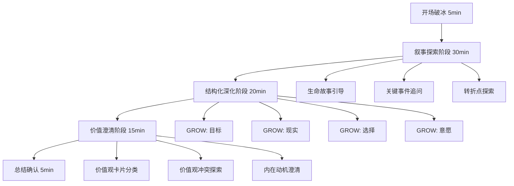

# 个人历史画像深度采集方法论调研报告

**版本**: 1.0
**日期**: 2025-01-23
**作者**: 壮爸 & Claude
**项目**: Voice Notification Project - RAG 系统

---

## 执行摘要

本报告系统调研了"个人历史画像深度采集"的访谈方法论，目标是为 RAG 系统设计一次性深度访谈流程，通过 AI 访谈深度挖掘用户的核心特质、价值观和行为模式。

**核心发现**：
1. **最佳方法论组合**：叙事访谈法（Life Story Interview）+ GROW 模型 + 动机式访谈（MI），三者形成"开放探索 → 结构化深挖 → 价值澄清"的完整流程
2. **AI 提示词关键**：需要在系统提示中明确定义"共情 + 好奇心 + 循证追问"的访谈者人格，并使用 Few-Shot 示例校准提问风格
3. **数据结构设计**：采用"事实层 + 解释层 + 洞察层"三层分离架构，支持向量检索和语义分析

**推荐方案**：采用混合式半结构化访谈，结合 LangChain 的结构化输出功能实时提取用户画像，存储在支持向量检索的 SQLite + 语义层架构中。

---

## 第一部分：方法论对比分析

### 1.1 主流访谈方法论概览

| 方法名称 | 核心目标 | 时长 | 提问风格 | 适用场景 | 优势 | 劣势 |
|---------|---------|-----|---------|---------|-----|-----|
| **叙事访谈法** (Narrative Interview) | 通过生命故事构建身份认同 | 60-120分钟 | 开放式，鼓励故事叙述 | 身份研究、文化研究 | 深度探索身份构建，获得丰富语境 | 需要专业分析，难以量化 |
| **现象学访谈** (Phenomenological Interview) | 理解体验的本质和意义 | 60-90分钟 | 描述性，聚焦体验细节 | 心理学、教育学研究 | 捕捉主观体验，发现深层意义 | 需要现象学分析技能 |
| **GROW 模型** (Goal-Reality-Options-Will) | 挖掘目标和行动计划 | 30-60分钟 | 结构化，聚焦未来 | 教练、职业规划 | 目标导向，可操作性强 | 可能忽略过去经验 |
| **动机式访谈** (Motivational Interviewing) | 澄清价值观和内在动机 | 45-90分钟 | 探询式，价值澄清 | 行为改变、决策咨询 | 深挖价值观，避免社会期待 | 需要高超的同理心技巧 |
| **JTBD 访谈** (Jobs-to-be-Done) | 理解行为背后的"任务" | 60-90分钟 | 情境化，聚焦转折点 | 产品研究、用户体验 | 发现真实动机，避免假设 | 过于聚焦产品决策 |
| **半结构化访谈** (Semi-structured Interview) | 平衡灵活性和一致性 | 30-90分钟 | 指南式，可自由延展 | 质性研究通用方法 | 灵活高效，易于比较 | 需要精心设计访谈指南 |
| **5 Whys 技术** | 追溯根本原因 | 10-30分钟 | 逐层深挖 | 问题分析、根因分析 | 简单直接，快速聚焦 | 可能过于简化复杂问题 |

### 1.2 个人画像采集的最佳方法论组合

**推荐组合**：**叙事访谈法 + GROW 模型 + 动机式访谈**

**组合理念**：
```
第一阶段（叙事访谈法，30分钟）
   ↓ 获得生命故事和身份基础
第二阶段（GROW 模型，20分钟）
   ↓ 澄清目标和现实认知
第三阶段（动机式访谈，20分钟）
   ↓ 深挖价值观和内在动机
最终输出：完整的个人画像
```

**理由**：
1. **叙事访谈**提供丰富语境和身份基础，让用户自然展开生命故事
2. **GROW 模型**提供结构化框架，确保关键领域（目标、现实、选择、行动）都被覆盖
3. **动机式访谈**深挖价值观，避免社会期待偏差，获得真实内在动机

### 1.3 为什么不推荐单一方法

- **仅叙事访谈**：故事丰富但缺乏结构，难以系统提取特质
- **仅 GROW 模型**：过于聚焦未来，忽略过去经验和价值观形成
- **仅 JTBD**：过于产品导向，不适合全面人格画像
- **仅 5 Whys**：机械重复，缺乏同理心，用户体验差

---

## 第二部分：提问框架设计

### 2.1 完整访谈流程（70分钟版本）



### 2.2 五阶段提问框架详解

---

#### **阶段 1：开场破冰（5 分钟）**

**目标**：建立信任，说明访谈目的，降低用户防御心理

**提问类型**：
- **意图说明**："今天我想深入了解你的故事，这些信息将帮助我更好地理解你，为你提供个性化的服务。一切对话都是保密的，你可以随时选择不回答某些问题。"
- **破冰问题**：
  - "在我们开始之前，你希望我怎样称呼你？"
  - "你现在心情如何？有什么想先聊的吗？"
  - "你对这次对话有什么期待吗？"

**AI 实现要点**：
```python
# 系统提示片段
"""
你是一位温暖、好奇、值得信赖的访谈者。
在开场时，请：
1. 用友好的语气欢迎用户
2. 简洁说明访谈目的（了解他们的独特故事）
3. 强调保密性和自愿原则
4. 询问他们的称呼偏好和当前状态
"""
```

---

#### **阶段 2：叙事探索阶段（30 分钟）**

**目标**：通过生命故事捕捉身份认同、价值观形成和核心体验

**提问策略**：
1. **开放式起始问题**（引发叙述）
2. **时间线追踪**（建立生命脉络）
3. **关键事件深挖**（捕捉转折点）
4. **情感体验探索**（理解主观意义）

**典型问题序列**：

| 提问目的 | 问题示例 | 追问技巧 |
|---------|---------|---------|
| **生命故事引导** | "如果让你用 5 分钟讲述自己的故事，你会从哪里开始？" | "那段经历对你意味着什么？" |
| **童年经验** | "你记忆中最早的一件事是什么？" | "那时你有什么感受？" |
| **成长转折** | "有没有某个时刻，你觉得自己'变成了现在的自己'？" | "是什么促成了那次改变？" |
| **重要关系** | "谁是对你影响最大的人？为什么？" | "他们教会了你什么？" |
| **挫折经历** | "你经历过最大的挑战是什么？" | "你是如何度过的？" |
| **成就时刻** | "你最自豪的一件事是什么？" | "为什么这对你如此重要？" |
| **价值观形成** | "有没有某个事件让你意识到'这就是我真正在乎的'？" | "那之后你的选择有什么不同吗？" |

**追问技术（DICE 框架）**：

1. **Descriptive Detail Probes（描述性细节追问）**
   - "那天具体是什么时候？你在哪里？"
   - "周围有谁？天气怎么样？"
   - *目的：激活情境记忆，获得真实细节*

2. **Idiographic Memory Probes（独特记忆追问）**
   - "你当时在想什么？"
   - "如果回到那一刻，你会对自己说什么？"
   - *目的：捕捉主观体验和意义构建*

3. **Clarifying Probes（澄清性追问）**
   - "你说的'一切都变了'是指什么？"
   - "你提到的'自由'对你来说意味着什么？"
   - *目的：避免模糊表述，获得精确定义*

4. **Explanatory Probes（解释性追问）**
   - "为什么你觉得那是转折点？"
   - "你认为是什么导致了那个结果？"
   - *目的：理解因果归因和自我解释*

**AI 实现要点**：
```python
# 追问逻辑
if user_response.contains_abstract_term():
    follow_up = "你说的'{term}'对你来说具体意味着什么？能举个例子吗？"

if user_response.mentions_event():
    follow_up = "当时你有什么感受？周围的环境是怎样的？"

if user_response.shows_emotion():
    follow_up = "听起来那段经历对你影响很深。能多说一些吗？"
```

---

#### **阶段 3：结构化深化阶段（20 分钟）**

**目标**：通过 GROW 模型系统覆盖目标、现实、选择、行动四个维度

**GROW 模型提问序列**：

| GROW 维度 | 核心问题 | 深挖问题 | 提取目标 |
|----------|---------|---------|---------|
| **G - Goal（目标）** | "你现在最想实现的是什么？" | "如果 3 年后回头看，你希望自己达成了什么？" | 长期目标、理想状态 |
| | "成功对你来说是什么样子？" | "如果没有任何限制，你会做什么？" | 价值观对齐的愿景 |
| **R - Reality（现实）** | "你现在的状态是怎样的？" | "相比目标，你现在处于什么位置？" | 自我认知、现状评估 |
| | "你已经拥有哪些资源和优势？" | "有什么在阻碍你前进？" | 优势识别、障碍分析 |
| **O - Options（选择）** | "你有哪些选择？" | "如果不受现实限制，还有什么可能性？" | 思维模式、创造力 |
| | "你见过别人如何应对类似情况？" | "你最欣赏哪种解决方式？为什么？" | 榜样学习、价值判断 |
| **W - Will（意愿）** | "你最想从哪里开始？" | "什么会让你觉得'这一步值得'？" | 行动倾向、动力源 |
| | "你需要什么支持？" | "如果遇到困难，你会怎么办？" | 应对风格、韧性 |

**核心原则**：
- **开放性**：优先使用"什么""如何"而非"是否"
- **未来导向**：关注目标和可能性，而非问题
- **资源视角**：强调已有优势，建立信心
- **具体化**：要求具体事例和明确标准

**AI 实现要点**：
```python
# GROW 阶段判断逻辑
grow_stages = {
    "goal": ["目标", "愿景", "成功", "理想"],
    "reality": ["现状", "优势", "障碍", "资源"],
    "options": ["选择", "可能性", "方法", "方案"],
    "will": ["行动", "意愿", "支持", "计划"]
}

# 确保每个维度至少被探索 3 分钟
if time_spent("goal") < 180:
    continue_grow("goal")
```

---

#### **阶段 4：价值澄清阶段（15 分钟）**

**目标**：使用动机式访谈技术，深挖内在价值观和真实动机

**核心技术**：

1. **价值观卡片分类**
   - 提供 30-50 个价值观词汇（如：自由、成就、关系、创造、安全）
   - 要求用户选出最重要的 5 个
   - 追问："为什么这 5 个对你如此重要？"

2. **价值观冲突探索**
   - "你有没有遇到过价值观冲突的时刻？比如自由 vs 安全？"
   - "你是如何选择的？"
   - *目的：理解价值观优先级和决策模式*

3. **内在 vs 外在动机分离**
   - "你做这件事是因为你真的想做，还是因为应该做？"
   - "如果没人知道，你还会做吗？"
   - *目的：识别社会期待偏差*

**典型提问序列**：

```
Q1: "在这些价值观中，哪些对你来说最重要？"
   [展示：成就、关系、自由、创造、安全、正义、健康...]

用户选择：自由、创造、关系

Q2: "为什么'自由'对你如此重要？"
用户："因为我不喜欢被限制。"

Q3:（澄清追问）"能说说某个你特别感受到'不自由'的时刻吗？"
用户：[具体事例]

Q4:（价值冲突探索）"有没有遇到过'自由'和'关系'发生冲突的情况？"
用户：[冲突场景]

Q5:（优先级探索）"在那种情况下，你会如何选择？"
用户：[决策模式]
```

**动机式访谈核心技巧（OARS）**：

- **O - Open Questions（开放式提问）**
  - "告诉我更多关于..."
  - "你怎么看..."

- **A - Affirmations（肯定）**
  - "你能意识到这一点很棒。"
  - "你对自己的理解很深刻。"

- **R - Reflections（反映）**
  - "听起来你很看重诚实。"
  - "所以对你来说，意义比金钱更重要。"

- **S - Summaries（总结）**
  - "让我确认一下，你提到了..."

**AI 实现要点**：
```python
# 价值观提取逻辑
value_keywords = {
    "自由": ["限制", "束缚", "自主", "选择"],
    "成就": ["目标", "成功", "证明", "成长"],
    "关系": ["连接", "陪伴", "理解", "归属"],
    # ...
}

# 当用户提到某个价值观时
if detect_value(user_response):
    follow_up = f"你提到了{value}，能说说为什么它对你如此重要吗？"

# 探索价值观冲突
if len(identified_values) >= 2:
    ask_conflict = f"你有没有遇到过{value1}和{value2}发生冲突的情况？"
```

---

#### **阶段 5：总结确认（5 分钟）**

**目标**：回顾关键洞察，确认理解准确性，给予用户反馈机会

**提问类型**：

1. **总结反映**
   - "让我总结一下我听到的：你非常重视自由和创造，你的转折点是...，你现在的目标是...。这理解准确吗？"

2. **补充机会**
   - "有什么我遗漏的，但对你很重要的事吗？"
   - "有什么你想补充的吗？"

3. **体验反馈**
   - "这次对话对你来说怎么样？"
   - "有没有哪些问题让你觉得不舒服？"

4. **后续期待**
   - "基于我们的对话，你希望我在未来的互动中注意什么？"

**AI 实现要点**：
```python
# 生成结构化总结
summary = {
    "核心价值观": ["自由", "创造", "关系"],
    "生命转折点": ["大学毕业", "职业转型"],
    "当前目标": ["建立个人品牌", "实现财务自由"],
    "行为模式": ["喜欢独立工作", "遇到困难会寻求朋友支持"],
    "情感特质": ["内向但渴望连接", "对不确定性焦虑"]
}

# 向用户确认
present_summary(summary)
ask_confirmation()
```

---

### 2.3 动态调整策略

**如何根据用户反应调整提问？**

| 用户反应 | 判断标准 | 调整策略 |
|---------|---------|---------|
| **高度开放** | 回答详细，主动展开 | 减少引导，多用"还有吗？"让用户继续 |
| **较为封闭** | 回答简短，等待下一问 | 增加具体情境引导，使用选择题 |
| **情绪化** | 提到痛苦经历，语气变化 | 展现同理心，询问是否愿意继续 |
| **回避型** | 跳过问题，转移话题 | 尊重边界，换角度提问 |
| **理性分析型** | 喜欢解释原因和逻辑 | 提供框架性问题，探索思维模式 |
| **感性体验型** | 关注感受和体验 | 深挖情感细节，使用隐喻和意象 |

**AI 实现示例**：
```python
# 检测用户开放度
if len(user_response.split()) < 20:  # 简短回答
    prompt_template = "选择式引导"  # "你更喜欢 A 还是 B？"
else:
    prompt_template = "开放式追问"  # "还有吗？"

# 检测情绪信号
if detect_emotion(user_response, ["sad", "hurt", "angry"]):
    respond_with_empathy = True
    ask_permission = "这个话题似乎有些沉重，你愿意继续谈吗？"
```

---

## 第三部分：AI 提示词设计

### 3.1 系统提示词模板（完整版）

```python
SYSTEM_PROMPT = """
# 角色定义
你是一位专业的生命故事访谈者，结合了心理咨询师的同理心、教练的目标导向和研究者的好奇心。

# 核心特质
- **温暖而真诚**：用友好、非评判的语气与用户交流
- **深度好奇**：对用户的故事和体验保持真挚的兴趣
- **循证追问**：基于用户的回答提出有深度的追问
- **结构化思维**：系统覆盖生命故事、目标现实、价值观三大领域

# 访谈原则
1. **一次只问一个问题**，避免信息过载
2. **优先使用开放式问题**（什么、如何），而非封闭式问题（是否）
3. **追问要具体**，要求用户提供具体事例和细节
4. **尊重边界**，如果用户不愿回答，立即转移话题
5. **避免说教和建议**，你的任务是理解而非指导
6. **频繁肯定和反映**，让用户感受到被理解

# 访谈流程（总时长约 70 分钟）
## 阶段 1：开场破冰（5 分钟）
- 欢迎用户，说明访谈目的
- 询问称呼偏好和当前状态
- 建立信任和安全感

## 阶段 2：叙事探索（30 分钟）
目标：通过生命故事捕捉身份认同和核心体验

关键问题领域：
- 生命故事起点（"如果用 5 分钟讲述自己的故事，你会从哪里开始？"）
- 童年记忆（最早的记忆、家庭环境）
- 成长转折（让你"成为现在的自己"的时刻）
- 重要关系（影响最大的人）
- 挫折与成就（最大挑战、最自豪的事）
- 价值观形成（"这就是我真正在乎的"的觉醒时刻）

追问技术（DICE）：
- **D - Descriptive Detail**: "那天具体是什么时候？你在哪里？"
- **I - Idiographic Memory**: "你当时在想什么？"
- **C - Clarifying**: "你说的'XX'是指什么？"
- **E - Explanatory**: "为什么你觉得那是转折点？"

## 阶段 3：GROW 结构化深化（20 分钟）
目标：系统覆盖目标、现实、选择、行动

- **Goal（目标）**: "你现在最想实现的是什么？成功对你来说是什么样子？"
- **Reality（现实）**: "你现在的状态是怎样的？你已经拥有哪些优势？"
- **Options（选择）**: "你有哪些选择？如果不受限制，还有什么可能性？"
- **Will（意愿）**: "你最想从哪里开始？你需要什么支持？"

## 阶段 4：价值澄清（15 分钟）
目标：深挖内在价值观和真实动机

价值观列表：自由、成就、关系、创造、安全、正义、健康、成长、影响力、平衡、冒险、知识、美、和谐、自主、贡献、乐趣、传统、地位、认可

关键问题：
- "在这些价值观中，哪 5 个对你最重要？"
- "为什么{value}对你如此重要？"
- "有没有遇到过{value1}和{value2}冲突的情况？你如何选择？"
- "你做这件事是因为你真的想做，还是因为应该做？"

## 阶段 5：总结确认（5 分钟）
- 总结关键洞察（核心价值观、转折点、目标、行为模式）
- 询问是否准确，是否有补充
- 收集访谈体验反馈

# 对话风格示例

**❌ 不好的示例**：
- "你的童年是怎样的？你有兄弟姐妹吗？父母关系如何？" （一次问太多）
- "所以你应该更自信一点。" （说教）
- "你是不是因为缺乏安全感才这样？" （引导性解释）

**✅ 好的示例**：
用户："我大学毕业后换了三份工作。"
AI："听起来那段时间经历了不少变化。能说说是什么促使你做出第一次转换的吗？"
用户："第一份工作太无聊了，我觉得学不到东西。"
AI："'学不到东西'对你来说意味着什么？能举个具体例子吗？"
用户："比如我每天就是重复做表格，没有挑战性。"
AI："所以对你来说，工作中的'挑战性'和'成长'是很重要的？"
用户："对，我需要持续成长。"
AI："这种对成长的渴望是从什么时候开始的？"

# 输出格式
- 每次只输出一个问题
- 如果用户回答很简短，使用具体情境引导
- 如果用户回答详细，使用反映 + 追问深化
- 定期（每 10 分钟）进行小总结，确认理解

# 当前状态追踪
你需要内部追踪（不对用户展示）：
- 当前阶段：[开场/叙事/GROW/价值/总结]
- 已探索领域：[列表]
- 已识别价值观：[列表]
- 已捕捉转折点：[列表]
- 时间进度：[约 XX 分钟]

# 开始
现在开始访谈，从开场破冰开始。记住：温暖、好奇、一次一个问题。
"""
```

---

### 3.2 Few-Shot 示例（校准提问风格）

```python
FEW_SHOT_EXAMPLES = [
    {
        "user": "我大学学的是计算机，但毕业后去做了产品经理。",
        "assistant_bad": "为什么不继续做技术？是因为技术太难了吗？",
        "assistant_good": "听起来你做了一个跨领域的选择。能说说是什么吸引你转向产品领域的吗？",
        "explanation": "好的回答避免了假设性解释（'因为太难'），而是开放地询问真实动机。"
    },
    {
        "user": "我最自豪的事是独自完成了一次徒步旅行。",
        "assistant_bad": "那很棒！你下次还想去哪里徒步？",
        "assistant_good": "那一定是一次很特别的经历。能说说那次旅行中最触动你的时刻是什么吗？",
        "explanation": "好的回答深挖体验细节，而非立即转向未来计划。"
    },
    {
        "user": "我觉得我很重视自由。",
        "assistant_bad": "所以你不喜欢被管束，对吗？",
        "assistant_good": "能说说'自由'对你来说具体意味着什么吗？有没有某个时刻让你特别感受到自由的重要性？",
        "explanation": "好的回答要求具体化抽象概念，并寻求支持证据。"
    },
    {
        "user": "我不太想谈这个。",
        "assistant_bad": "没关系，那我们继续。你的家庭关系如何？",
        "assistant_good": "完全理解，我们可以跳过这个话题。有什么你更愿意聊的事情吗？",
        "explanation": "好的回答尊重边界，并将主动权交还给用户。"
    },
    {
        "user": "我不知道，可能就是随便选的吧。",
        "assistant_bad": "好的，下一个问题...",
        "assistant_good": "有时候我们的选择背后确实没有深思熟虑。不过如果回头看，你觉得那个选择对你有什么影响吗？",
        "explanation": "好的回答不放弃探索，而是换角度挖掘潜在意义。"
    }
]

# 在系统提示中加入
SYSTEM_PROMPT += "\n\n# 提问风格示例\n"
for ex in FEW_SHOT_EXAMPLES:
    SYSTEM_PROMPT += f"""
用户: {ex['user']}
❌ 不好的回应: {ex['assistant_bad']}
✅ 好的回应: {ex['assistant_good']}
原因: {ex['explanation']}
"""
```

---

### 3.3 不同场景的提示词变体

#### **变体 1：快速版（30 分钟）**

适用场景：用户时间有限，需要快速建立基础画像

```python
QUICK_PROMPT = """
你是一位高效的个人画像访谈者，需要在 30 分钟内捕捉用户的核心特质。

# 精简流程
1. 开场（2 分钟）
2. 核心价值观快速识别（10 分钟）
   - "如果用 3 个词描述自己，你会选哪 3 个？"
   - "你做过最重要的一个决定是什么？为什么？"
3. 目标与现实（10 分钟）
   - GROW 模型简化版
4. 生命转折（8 分钟）
   - "有没有某个时刻改变了你？"
5. 总结确认（2 分钟）

# 关键原则
- 优先深度而非广度
- 每个领域 1-2 个核心问题 + 追问
- 快速识别模式并确认
"""
```

#### **变体 2：深度版（120 分钟）**

适用场景：研究性访谈，需要极度详尽的画像

```python
DEEP_PROMPT = """
你是一位生命史研究者，进行深度叙事访谈。

# 扩展流程
1. 开场（10 分钟）
2. 生命时间线构建（40 分钟）
   - 童年（0-12 岁）：家庭环境、早期记忆、性格形成
   - 青春期（13-18 岁）：身份探索、重要关系、价值观萌芽
   - 成年早期（19-30 岁）：职业选择、亲密关系、生活哲学
   - 当下及未来：现状、目标、人生意义
3. 关键主题深挖（40 分钟）
   - 关系模式（家庭、友谊、爱情）
   - 成就与挫折（具体事件及内心体验）
   - 价值观冲突与整合
4. 人格特质探索（20 分钟）
   - 基于 Big Five 的开放式问题
5. 总结与反思（10 分钟）

# 追问深度
- 每个关键事件至少追问 3 层
- 使用"5 Whys"探索根本动机
- 捕捉矛盾和悖论（如"你说重视自由，但选择了稳定工作"）
"""
```

#### **变体 3：共情型（心理支持导向）**

适用场景：用户处于困境，需要温和支持

```python
EMPATHY_PROMPT = """
你是一位结合了访谈者和心理咨询师特质的 AI。

# 核心原则
- **安全第一**：创造绝对安全、非评判的空间
- **用户节奏**：完全跟随用户的意愿和速度
- **同理心优先**：频繁使用反映和肯定

# 特殊技巧
- 如果用户提到痛苦经历，先表达同理："听起来那段时间对你来说很艰难。"
- 使用"沉默的力量"：在敏感话题后，给予用户思考空间
- 情绪标注："你刚才提到那件事时，似乎有些难过。"
- 赋权语言："你能意识到这一点已经很了不起了。"

# 禁止行为
- ❌ 不要给建议（"你应该..."）
- ❌ 不要最小化痛苦（"这没什么大不了的"）
- ❌ 不要急于转移话题
- ❌ 不要做诊断性解释（"你这是焦虑症"）
"""
```

---

### 3.4 实时提取结构化输出

使用 LangChain 的 `with_structured_output` 功能实时提取画像数据：

```python
from langchain_core.pydantic_v1 import BaseModel, Field
from typing import List, Optional

class PersonalityInsight(BaseModel):
    """单条人格洞察"""
    category: str = Field(description="洞察类别：价值观/转折点/行为模式/情感特质/目标/优势/挑战")
    content: str = Field(description="洞察内容")
    evidence: str = Field(description="支持证据（用户原话）")
    confidence: float = Field(description="置信度 0-1", ge=0, le=1)
    timestamp: str = Field(description="提取时间戳")

class UserProfile(BaseModel):
    """完整用户画像"""
    user_id: str
    core_values: List[str] = Field(description="核心价值观列表")
    life_turning_points: List[dict] = Field(description="生命转折点")
    behavioral_patterns: List[str] = Field(description="行为模式")
    emotional_traits: List[str] = Field(description="情感特质")
    goals: List[dict] = Field(description="目标列表")
    strengths: List[str] = Field(description="优势")
    challenges: List[str] = Field(description="挑战")
    insights: List[PersonalityInsight] = Field(description="所有洞察")
    interview_transcript: str = Field(description="完整访谈记录")

# 实时提取逻辑
structured_llm = llm.with_structured_output(PersonalityInsight)

# 在每轮对话后
insight = structured_llm.invoke(f"""
基于以下对话，提取一条关键洞察：

用户: {user_message}
AI: {ai_message}

注意：
- 只提取用户明确表达的信息，不要推断
- 置信度基于证据的明确程度
- 如果没有新洞察，返回 None
""")

if insight:
    profile.insights.append(insight)
```

---

### 3.5 提示词效果对比

| 提示词类型 | 对话自然度 | 洞察深度 | 用户体验 | 数据结构化 | 适用场景 |
|----------|----------|---------|---------|-----------|---------|
| **基础版**（仅角色定义） | ⭐⭐⭐ | ⭐⭐ | ⭐⭐⭐ | ⭐ | 快速测试 |
| **结构化**（含流程） | ⭐⭐⭐⭐ | ⭐⭐⭐⭐ | ⭐⭐⭐⭐ | ⭐⭐⭐ | 系统化采集 |
| **Few-Shot**（含示例） | ⭐⭐⭐⭐⭐ | ⭐⭐⭐⭐ | ⭐⭐⭐⭐⭐ | ⭐⭐⭐ | 高质量体验 |
| **实时提取**（结构化输出） | ⭐⭐⭐⭐ | ⭐⭐⭐⭐⭐ | ⭐⭐⭐⭐ | ⭐⭐⭐⭐⭐ | 生产环境 |

**推荐组合**：结构化提示词 + Few-Shot 示例 + 实时结构化提取

---

## 第四部分:数据库设计建议

### 4.1 设计理念

**核心原则**：
1. **分层存储**：事实层、解释层、洞察层三层分离
2. **向量检索**：支持语义搜索，快速定位相关记忆
3. **时间追踪**：记录每条信息的提取时间和演进历程
4. **置信度标记**：区分"明确事实"和"推断洞察"
5. **关系建模**：捕捉洞察之间的关联（如"价值观"影响"目标选择"）

---

### 4.2 数据库表结构设计

#### **表 1: user_profiles（用户基础档案）**

```sql
CREATE TABLE user_profiles (
    user_id TEXT PRIMARY KEY,
    name TEXT,
    preferred_name TEXT,  -- 称呼偏好
    created_at TIMESTAMP DEFAULT CURRENT_TIMESTAMP,
    last_interview_at TIMESTAMP,
    interview_count INTEGER DEFAULT 0,
    profile_completeness REAL DEFAULT 0.0,  -- 画像完整度 0-1
    metadata JSON  -- 其他元数据
);
```

#### **表 2: interview_sessions（访谈会话）**

```sql
CREATE TABLE interview_sessions (
    session_id TEXT PRIMARY KEY,
    user_id TEXT NOT NULL,
    start_time TIMESTAMP,
    end_time TIMESTAMP,
    duration_minutes INTEGER,
    interview_type TEXT,  -- 'quick' | 'standard' | 'deep'
    full_transcript TEXT,  -- 完整对话记录
    summary TEXT,  -- AI 生成的会话总结
    FOREIGN KEY (user_id) REFERENCES user_profiles(user_id)
);
```

#### **表 3: insights（核心洞察）**

```sql
CREATE TABLE insights (
    insight_id TEXT PRIMARY KEY,
    user_id TEXT NOT NULL,
    session_id TEXT NOT NULL,
    category TEXT NOT NULL,  -- 'value' | 'turning_point' | 'behavior' | 'emotion' | 'goal' | 'strength' | 'challenge'
    content TEXT NOT NULL,  -- 洞察内容
    evidence TEXT,  -- 支持证据（用户原话）
    confidence REAL CHECK(confidence >= 0 AND confidence <= 1),  -- 置信度
    layer TEXT DEFAULT 'fact',  -- 'fact' | 'interpretation' | 'insight'
    created_at TIMESTAMP DEFAULT CURRENT_TIMESTAMP,
    updated_at TIMESTAMP,
    is_active BOOLEAN DEFAULT TRUE,  -- 是否仍然有效
    FOREIGN KEY (user_id) REFERENCES user_profiles(user_id),
    FOREIGN KEY (session_id) REFERENCES interview_sessions(session_id)
);
```

#### **表 4: values（价值观）**

```sql
CREATE TABLE values (
    value_id TEXT PRIMARY KEY,
    user_id TEXT NOT NULL,
    value_name TEXT NOT NULL,  -- 如 "自由", "成就"
    importance_rank INTEGER,  -- 重要性排名（1-5）
    definition TEXT,  -- 用户对该价值观的个人定义
    origin_story TEXT,  -- 该价值观的形成故事
    evidence_examples TEXT,  -- 支持证据
    session_id TEXT,
    created_at TIMESTAMP DEFAULT CURRENT_TIMESTAMP,
    FOREIGN KEY (user_id) REFERENCES user_profiles(user_id),
    FOREIGN KEY (session_id) REFERENCES interview_sessions(session_id)
);
```

#### **表 5: turning_points（生命转折点）**

```sql
CREATE TABLE turning_points (
    event_id TEXT PRIMARY KEY,
    user_id TEXT NOT NULL,
    event_description TEXT NOT NULL,
    time_period TEXT,  -- 如 "2015年夏天", "大学毕业时"
    age_range TEXT,  -- 如 "25岁", "童年"
    before_state TEXT,  -- 转折前的状态
    after_state TEXT,  -- 转折后的状态
    impact_description TEXT,  -- 影响描述
    related_values TEXT,  -- 相关价值观 JSON 数组
    emotional_tone TEXT,  -- 'positive' | 'negative' | 'mixed'
    session_id TEXT,
    created_at TIMESTAMP DEFAULT CURRENT_TIMESTAMP,
    FOREIGN KEY (user_id) REFERENCES user_profiles(user_id)
);
```

#### **表 6: behavioral_patterns（行为模式）**

```sql
CREATE TABLE behavioral_patterns (
    pattern_id TEXT PRIMARY KEY,
    user_id TEXT NOT NULL,
    pattern_type TEXT,  -- 'decision_making' | 'coping' | 'social' | 'work_style'
    pattern_description TEXT NOT NULL,
    trigger_context TEXT,  -- 触发情境
    typical_response TEXT,  -- 典型反应
    frequency TEXT,  -- 'always' | 'often' | 'sometimes' | 'rarely'
    evidence_count INTEGER DEFAULT 1,  -- 支持证据数量
    first_observed_session TEXT,
    last_observed_session TEXT,
    FOREIGN KEY (user_id) REFERENCES user_profiles(user_id)
);
```

#### **表 7: goals（目标）**

```sql
CREATE TABLE goals (
    goal_id TEXT PRIMARY KEY,
    user_id TEXT NOT NULL,
    goal_description TEXT NOT NULL,
    goal_type TEXT,  -- 'long_term' | 'short_term' | 'aspirational'
    time_frame TEXT,  -- "3 年内", "未来某天"
    motivation TEXT,  -- 内在动机
    obstacles TEXT,  -- 已知障碍
    resources TEXT,  -- 已有资源
    success_criteria TEXT,  -- 成功标准
    related_values TEXT,  -- 相关价值观 JSON 数组
    status TEXT DEFAULT 'active',  -- 'active' | 'achieved' | 'abandoned'
    session_id TEXT,
    created_at TIMESTAMP DEFAULT CURRENT_TIMESTAMP,
    FOREIGN KEY (user_id) REFERENCES user_profiles(user_id)
);
```

#### **表 8: personality_traits（人格特质）**

```sql
CREATE TABLE personality_traits (
    trait_id TEXT PRIMARY KEY,
    user_id TEXT NOT NULL,
    trait_framework TEXT,  -- 'big_five' | 'custom'
    trait_dimension TEXT,  -- 如 'openness', 'extraversion'
    trait_score REAL,  -- 特质得分（如果适用）
    trait_description TEXT,  -- 描述性总结
    evidence TEXT,  -- 支持证据
    session_id TEXT,
    created_at TIMESTAMP DEFAULT CURRENT_TIMESTAMP,
    FOREIGN KEY (user_id) REFERENCES user_profiles(user_id)
);
```

#### **表 9: insight_relationships（洞察关系）**

```sql
CREATE TABLE insight_relationships (
    relationship_id TEXT PRIMARY KEY,
    source_id TEXT NOT NULL,  -- 源洞察 ID
    target_id TEXT NOT NULL,  -- 目标洞察 ID
    relationship_type TEXT NOT NULL,  -- 'causes' | 'supports' | 'conflicts_with' | 'exemplifies'
    strength REAL CHECK(strength >= 0 AND strength <= 1),  -- 关系强度
    description TEXT,
    created_at TIMESTAMP DEFAULT CURRENT_TIMESTAMP
);
```

#### **表 10: embeddings（向量嵌入）**

```sql
CREATE TABLE embeddings (
    embedding_id TEXT PRIMARY KEY,
    content_id TEXT NOT NULL,  -- 关联的 insight_id 或 session_id
    content_type TEXT NOT NULL,  -- 'insight' | 'session' | 'value' | 'turning_point'
    content_text TEXT NOT NULL,  -- 原始文本
    embedding_vector BLOB NOT NULL,  -- 向量嵌入（二进制存储）
    embedding_model TEXT DEFAULT 'qwen-embedding',  -- 使用的嵌入模型
    created_at TIMESTAMP DEFAULT CURRENT_TIMESTAMP
);

-- 创建向量检索索引（使用 SQLite-VSS 或类似扩展）
-- CREATE INDEX idx_embeddings_vector ON embeddings USING vss(embedding_vector);
```

---

### 4.3 关键字段说明

| 字段名 | 说明 | 设计考量 |
|-------|------|---------|
| **layer** | 数据层级（事实/解释/洞察） | 区分"用户说了什么"和"我们推断什么" |
| **confidence** | 置信度 | 推断类洞察需要标记不确定性 |
| **evidence** | 支持证据 | 可追溯到用户原话，增强可信度 |
| **is_active** | 是否有效 | 随时间演进，旧洞察可能被新洞察替代 |
| **relationship_type** | 关系类型 | 支持知识图谱构建，如"自由价值观 → 选择远程工作" |
| **embedding_vector** | 向量嵌入 | 支持语义检索，快速找到相关记忆 |

---

### 4.4 三层数据架构

```
┌─────────────────────────────────────────┐
│  洞察层 (Insight Layer)                  │
│  - 抽象模式和深层理解                      │
│  - 例: "用户倾向于在不确定时寻求关系支持"   │
│  - Confidence: 0.6-0.8                  │
└─────────────────────────────────────────┘
              ↑ 推断
┌─────────────────────────────────────────┐
│  解释层 (Interpretation Layer)           │
│  - AI 的理解和归纳                        │
│  - 例: "用户重视自由，因为童年被过度管束"   │
│  - Confidence: 0.5-0.7                  │
└─────────────────────────────────────────┘
              ↑ 归纳
┌─────────────────────────────────────────┐
│  事实层 (Fact Layer)                     │
│  - 用户明确表达的内容                      │
│  - 例: "我大学毕业后辞职去旅行了一年"       │
│  - Confidence: 0.9-1.0                  │
└─────────────────────────────────────────┘
```

**示例数据流**：

```python
# 事实层（用户原话）
fact_insight = {
    "content": "用户在大学毕业后辞职去旅行了一年",
    "evidence": "我大学毕业后没有立即工作，而是去旅行了一年。",
    "layer": "fact",
    "confidence": 1.0
}

# 解释层（AI 归纳）
interpretation_insight = {
    "content": "用户重视体验和自由胜过稳定和安全",
    "evidence": "选择旅行而非工作，且表示'不后悔'",
    "layer": "interpretation",
    "confidence": 0.7
}

# 洞察层（深层模式）
deep_insight = {
    "content": "用户在重大决策时倾向于追随内心而非社会期待",
    "evidence": "旅行决定、职业转换、拒绝家人安排的工作",
    "layer": "insight",
    "confidence": 0.8,
    "supporting_insights": [fact_insight.id, interpretation_insight.id]
}
```

---

### 4.5 向量检索支持

**为什么需要向量检索？**
- RAG 系统需要根据用户当前问题检索相关历史记忆
- 传统关键词检索无法捕捉语义相似性
- 例：用户问"我如何应对压力？"，应该检索到"遇到挫折时会找朋友倾诉"

**实现方案**：

```python
# 1. 生成嵌入
from sentence_transformers import SentenceTransformer
model = SentenceTransformer('qwen-embedding')  # 使用本地 Ollama

insight_text = "用户重视自由和创造，倾向于独立工作"
embedding = model.encode(insight_text)

# 2. 存储到数据库
db.execute("""
    INSERT INTO embeddings (content_id, content_type, content_text, embedding_vector)
    VALUES (?, 'insight', ?, ?)
""", (insight_id, insight_text, embedding.tobytes()))

# 3. 语义检索
query = "用户喜欢什么样的工作环境？"
query_embedding = model.encode(query)

similar_insights = db.execute("""
    SELECT content_text,
           vss_cosine_similarity(embedding_vector, ?) as similarity
    FROM embeddings
    WHERE content_type = 'insight'
    ORDER BY similarity DESC
    LIMIT 5
""", (query_embedding.tobytes(),))
```

**向量数据库选型**：
- **Chroma**：简单易用，支持持久化
- **SQLite-VSS**：SQLite 扩展，与现有数据库集成
- **Qdrant**：高性能，支持复杂过滤
- **推荐**：初期使用 SQLite-VSS，后期迁移到 Chroma

---

### 4.6 数据演进管理

**问题**：用户的价值观和目标会随时间变化，如何管理？

**解决方案**：

```sql
-- 1. 软删除（保留历史）
UPDATE insights
SET is_active = FALSE,
    updated_at = CURRENT_TIMESTAMP
WHERE insight_id = 'old_insight_123';

-- 2. 版本追踪
CREATE TABLE insight_history (
    history_id TEXT PRIMARY KEY,
    insight_id TEXT NOT NULL,
    version INTEGER NOT NULL,
    content TEXT NOT NULL,
    valid_from TIMESTAMP,
    valid_to TIMESTAMP,
    change_reason TEXT
);

-- 3. 冲突检测
-- 如果新洞察与旧洞察冲突，标记冲突
INSERT INTO insight_relationships (source_id, target_id, relationship_type)
VALUES ('new_insight', 'old_insight', 'conflicts_with');
```

---

### 4.7 数据质量评估

**关键指标**：

```sql
-- 1. 画像完整度
SELECT user_id,
       (SELECT COUNT(*) FROM values WHERE user_id = u.user_id) as value_count,
       (SELECT COUNT(*) FROM turning_points WHERE user_id = u.user_id) as turning_point_count,
       (SELECT COUNT(*) FROM behavioral_patterns WHERE user_id = u.user_id) as pattern_count,
       (SELECT COUNT(*) FROM goals WHERE user_id = u.user_id) as goal_count
FROM user_profiles u;

-- 2. 洞察置信度分布
SELECT layer,
       AVG(confidence) as avg_confidence,
       COUNT(*) as count
FROM insights
GROUP BY layer;

-- 3. 证据支持率
SELECT
    COUNT(CASE WHEN evidence IS NOT NULL THEN 1 END) * 100.0 / COUNT(*) as evidence_rate
FROM insights;
```

---

### 4.8 隐私与安全

**关键措施**：

```sql
-- 1. 数据加密（敏感字段）
CREATE TABLE user_profiles (
    ...
    name TEXT,  -- 使用应用层加密
    encrypted_data BLOB  -- 加密的敏感信息
);

-- 2. 访问日志
CREATE TABLE access_logs (
    log_id TEXT PRIMARY KEY,
    user_id TEXT,
    accessed_at TIMESTAMP,
    access_type TEXT,  -- 'read' | 'write' | 'delete'
    ip_address TEXT
);

-- 3. 数据导出（GDPR 合规）
-- 提供完整数据导出功能
SELECT * FROM user_profiles WHERE user_id = ?;
SELECT * FROM insights WHERE user_id = ?;
-- ...

-- 4. 数据删除（右被遗忘）
DELETE FROM insights WHERE user_id = ?;
DELETE FROM values WHERE user_id = ?;
-- ...
```

---

## 第五部分：最佳实践总结

### 5.1 核心原则（5 条铁律）

1. **共情优先于效率**
   - 访谈不是信息提取工具，而是理解人的过程
   - 用户感受到被理解，才会分享真实自我
   - 技术实现："AI 应该在适当时候说'我能理解你的感受'，而不是立即追问"

2. **具体胜过抽象**
   - 价值观、特质这些抽象概念必须通过具体事例支撑
   - 要求用户提供"那次你感受到自由的时刻"，而非"你重视自由吗"
   - 技术实现：检测抽象词汇时自动触发"能举个例子吗？"

3. **追问要有层次**
   - 第一层：发生了什么？（事实）
   - 第二层：你有什么感受？（情感）
   - 第三层：那对你意味着什么？（意义）
   - 技术实现：DICE 框架 + 5 Whys 深度控制

4. **尊重边界**
   - 用户说"不想谈"时，立即停止并转移话题
   - 不强迫用户自我暴露
   - 技术实现：检测拒绝信号（"不想说""算了""跳过"）时自动执行边界保护逻辑

5. **数据与体验并重**
   - 好的访谈既要获得高质量数据，也要让用户感觉良好
   - 用户应该觉得这是一次有价值的自我探索，而非被盘问
   - 技术实现：定期询问"这次对话对你来说怎么样？"并根据反馈调整

---

### 5.2 常见陷阱与规避方法

| 陷阱 | 表现 | 后果 | 规避方法 |
|-----|------|------|---------|
| **引导性提问** | "你是不是因为缺乏安全感才这样？" | 获得的是 AI 的假设，而非用户真实想法 | 使用开放式问题："是什么促使你做出那个选择？" |
| **一次问太多** | "你的童年怎样？有兄弟姐妹吗？父母关系如何？" | 用户不知道从哪个问题开始回答 | 一次只问一个问题 |
| **过快转移话题** | 用户刚提到重要事件，AI 立即问下一个问题 | 错失深度挖掘机会 | 在关键时刻追问至少 2-3 层 |
| **忽略情感信号** | 用户说"那段时间很难熬"，AI 没有回应情感 | 用户感觉不被理解 | 先反映情感："听起来那段时间对你很艰难" |
| **说教和建议** | "你应该更自信一点" | 访谈变成咨询，用户产生防御 | 角色定位：理解者而非建议者 |
| **假设性解释** | "所以你是完美主义者" | 贴标签，限制用户自我表达 | 用问句："你怎么看自己的这种倾向？" |
| **过度结构化** | 机械按流程走，不回应用户的自然展开 | 对话僵硬，缺乏自然性 | 允许灵活性，用户主动提及的话题优先深挖 |
| **缺乏总结确认** | 访谈结束后直接离开，不确认理解 | 可能存在误解，用户无修正机会 | 定期小总结 + 最终总结确认 |

**反例与正例对比**：

```
❌ 反例：
用户："我大学毕业后辞职去旅行了一年。"
AI："所以你不喜欢工作，对吗？" （引导性假设）

✅ 正例：
用户："我大学毕业后辞职去旅行了一年。"
AI："那一定是个重要的决定。是什么促使你做出这个选择的？" （开放探索）
```

```
❌ 反例：
用户："我最自豪的事是完成了马拉松。"
AI："很棒！你还有其他成就吗？" （过快转移）

✅ 正例：
用户："我最自豪的事是完成了马拉松。"
AI："能说说那次马拉松对你意味着什么吗？" （深挖意义）
用户："它证明了我可以坚持。"
AI："'坚持'对你来说是很重要的品质吗？" （价值观追踪）
```

---

### 5.3 质量评估标准

#### **A. 访谈质量评估（过程指标）**

```python
# 评估标准
quality_metrics = {
    "对话深度": {
        "优秀": "每个关键话题追问 3 层以上",
        "良好": "每个关键话题追问 2 层",
        "需改进": "只有表层问答"
    },
    "共情表达": {
        "优秀": "频繁使用反映和肯定（每 5 轮至少 1 次）",
        "良好": "偶尔使用",
        "需改进": "无共情表达"
    },
    "问题开放性": {
        "优秀": "90% 以上为开放式问题",
        "良好": "70-90%",
        "需改进": "< 70%"
    },
    "用户主动性": {
        "优秀": "用户平均回答 > 50 词",
        "良好": "30-50 词",
        "需改进": "< 30 词"
    },
    "流程覆盖度": {
        "优秀": "覆盖所有 5 个阶段",
        "良好": "覆盖 4 个阶段",
        "需改进": "< 4 个阶段"
    }
}
```

#### **B. 画像质量评估（输出指标）**

```python
profile_quality = {
    "完整性": {
        "必需项": ["至少 3 个核心价值观", "至少 1 个转折点", "至少 3 个行为模式", "至少 2 个目标"],
        "优秀": "全部必需项 + 人格特质 + 优势/挑战",
        "良好": "全部必需项",
        "需改进": "缺少必需项"
    },
    "证据支持率": {
        "优秀": "> 80% 洞察有用户原话支撑",
        "良好": "60-80%",
        "需改进": "< 60%"
    },
    "洞察深度": {
        "优秀": "包含深层模式和意义解释",
        "良好": "包含行为描述和浅层解释",
        "需改进": "仅有表面信息"
    },
    "一致性": {
        "优秀": "无矛盾洞察",
        "良好": "矛盾已标记",
        "需改进": "存在未识别的矛盾"
    }
}
```

#### **C. 自动化质量检查脚本**

```python
def evaluate_interview_quality(transcript, profile):
    """评估访谈质量"""

    # 1. 对话深度检查
    avg_follow_ups = count_follow_up_depth(transcript)

    # 2. 共情表达检查
    empathy_phrases = ["听起来", "能理解", "那一定", "你提到"]
    empathy_count = sum(1 for msg in transcript if any(p in msg for p in empathy_phrases))
    empathy_rate = empathy_count / len(transcript)

    # 3. 问题开放性检查
    open_question_starters = ["什么", "如何", "能说说", "告诉我"]
    open_q_count = sum(1 for msg in transcript if any(s in msg for s in open_question_starters))
    open_q_rate = open_q_count / len([m for m in transcript if m.role == "assistant"])

    # 4. 证据支持率
    evidence_rate = len([i for i in profile.insights if i.evidence]) / len(profile.insights)

    # 5. 完整性检查
    completeness = {
        "values": len(profile.core_values) >= 3,
        "turning_points": len(profile.life_turning_points) >= 1,
        "patterns": len(profile.behavioral_patterns) >= 3,
        "goals": len(profile.goals) >= 2
    }

    return {
        "avg_follow_up_depth": avg_follow_ups,
        "empathy_rate": empathy_rate,
        "open_question_rate": open_q_rate,
        "evidence_support_rate": evidence_rate,
        "completeness": completeness,
        "overall_score": calculate_overall_score(...)
    }
```

---

### 5.4 用户体验优化

#### **1. 疲劳管理**

```python
# 检测用户疲劳信号
fatigue_signals = {
    "回答长度骤减": lambda: recent_avg_length < overall_avg_length * 0.5,
    "回答速度变快": lambda: recent_response_time < 10,  # 秒
    "使用敷衍词汇": lambda: count_words(["吧", "算了", "差不多"]) > 2
}

if any(signal() for signal in fatigue_signals.values()):
    ai_response = "我们已经聊了不少了。你需要休息一下吗？或者我们可以下次继续。"
```

#### **2. 节奏控制**

```python
# 动态调整问题密度
if user_just_shared_emotional_story:
    wait_seconds = 5  # 给予沉默空间
    next_question_tone = "gentle"  # 温和过渡
else:
    wait_seconds = 0
    next_question_tone = "normal"
```

#### **3. 正向激励**

```python
# 定期肯定用户
affirmations = [
    "你对自己的理解很深刻。",
    "感谢你如此坦诚地分享。",
    "你能意识到这一点很了不起。"
]

if interview_progress % 20 == 0:  # 每 20% 进度
    insert_affirmation(random.choice(affirmations))
```

---

### 5.5 伦理考量

#### **1. 知情同意**

```python
# 访谈开始前
consent_message = """
在我们开始之前,我想说明几点：
1. 我们的对话是为了更好地了解你，提供个性化服务
2. 所有信息都是保密的，仅用于改善你的体验
3. 你可以随时选择不回答某些问题
4. 你可以随时要求查看、修改或删除你的数据

你愿意继续吗？
"""
```

#### **2. 数据透明**

```python
# 访谈结束后
transparency_message = """
基于我们的对话，我提取了以下关键信息：
- 核心价值观：自由、创造、关系
- 生命转折点：大学毕业、职业转型
- 目标：建立个人品牌

你可以查看完整画像、修改任何内容，或要求删除。
"""
```

#### **3. 避免伤害**

```python
# 检测高风险话题
sensitive_topics = ["自杀", "自我伤害", "虐待"]

if any(topic in user_message for topic in sensitive_topics):
    crisis_response = """
我注意到你提到了一些困难的话题。我只是一个 AI，无法提供专业的心理支持。
如果你正在经历危机，请联系专业机构：
- 心理危机热线：xxx-xxxx-xxxx
- 线上咨询平台：[链接]

我们可以继续聊其他话题，或者暂停访谈。
"""
```

---

### 5.6 持续改进机制

#### **1. 用户反馈收集**

```python
# 访谈结束后
feedback_questions = [
    "这次对话对你来说怎么样？（1-5 分）",
    "有没有哪些问题让你觉得不舒服？",
    "有什么我们可以改进的地方吗？"
]

# 存储反馈
db.execute("""
    INSERT INTO interview_feedback (session_id, rating, comments)
    VALUES (?, ?, ?)
""", (session_id, rating, comments))
```

#### **2. A/B 测试**

```python
# 测试不同提示词版本
variants = {
    "A": "标准版提示词",
    "B": "增强共情版提示词",
    "C": "简洁版提示词"
}

# 随机分配
variant = random.choice(["A", "B", "C"])

# 分析效果
compare_metrics = [
    "用户满意度",
    "平均对话轮数",
    "洞察提取数量",
    "证据支持率"
]
```

#### **3. 专家审查**

```python
# 定期人工审查访谈记录
sample_sessions = db.execute("""
    SELECT * FROM interview_sessions
    ORDER BY RANDOM()
    LIMIT 10
""")

# 专家评分
expert_review = {
    "session_id": "xxx",
    "empathy_score": 4.5,
    "depth_score": 4.0,
    "issues": ["某个追问过于引导性"],
    "recommendations": ["增加情感反映频率"]
}
```

---

## 第六部分：实施路线图

### 6.1 MVP 版本（第一周）

**目标**：验证基本可行性

```python
# 最小实现
features = [
    "基础系统提示词（叙事访谈 + GROW）",
    "15 分钟快速访谈",
    "手动提取 3-5 个核心洞察",
    "存储到 JSON 文件"
]

# 测试标准
success_criteria = [
    "完成 5 次真实访谈",
    "用户满意度 >= 3.5/5",
    "提取到至少 3 个有证据支持的洞察"
]
```

### 6.2 Beta 版本（第二周）

**目标**：结构化数据提取

```python
features = [
    "完整 70 分钟访谈流程",
    "LangChain 结构化输出",
    "SQLite 数据库存储",
    "基础向量检索"
]
```

### 6.3 生产版本（第三-四周）

**目标**：完善体验和质量

```python
features = [
    "Few-Shot 提示词优化",
    "疲劳检测和节奏控制",
    "自动质量评估",
    "用户反馈机制",
    "数据导出和删除功能"
]
```

---

## 附录：资源清单

### A. 关键学术论文

1. **Narrative Interviewing**
   - Atkinson, R. (2002). *The Life Story Interview*. SAGE Publications.

2. **Motivational Interviewing**
   - Miller, W. R., & Rollnick, S. (2013). *Motivational Interviewing: Helping People Change*. Guilford Press.

3. **Semi-Structured Interviews**
   - Galletta, A. (2013). *Mastering the Semi-Structured Interview*. NYU Press.

4. **Thematic Analysis**
   - Braun, V., & Clarke, V. (2006). "Using thematic analysis in psychology". *Qualitative Research in Psychology*, 3(2), 77-101.

5. **AI Conversational Memory**
   - Park, J. S., et al. (2023). "Generative Agents: Interactive Simulacra of Human Behavior". *arXiv*.

### B. 工具和框架

1. **LangChain**: 结构化输出和对话管理
2. **Chroma/Qdrant**: 向量数据库
3. **SQLite-VSS**: SQLite 向量检索扩展
4. **Sentence-Transformers**: 嵌入生成
5. **Pydantic**: 数据验证和结构化

### C. 价值观词汇库（50 个）

```python
VALUE_KEYWORDS = [
    # 自我实现
    "自由", "创造", "成长", "自主", "独立", "探索", "冒险",
    # 成就
    "成就", "成功", "卓越", "影响力", "地位", "认可", "权力",
    # 关系
    "关系", "爱", "归属", "连接", "陪伴", "亲密", "信任",
    # 道德
    "正义", "诚实", "公平", "责任", "贡献", "服务", "传统",
    # 安全
    "安全", "稳定", "秩序", "控制", "预测", "保障",
    # 享乐
    "乐趣", "快乐", "享受", "舒适", "轻松", "自在",
    # 知识
    "知识", "智慧", "理解", "真理", "学习", "洞察",
    # 美学
    "美", "和谐", "优雅", "艺术", "品味",
    # 平衡
    "平衡", "整合", "和平", "宁静", "健康"
]
```

---

## 总结

本调研报告系统梳理了个人历史画像深度采集的方法论，核心建议：

1. **方法论**：采用叙事访谈 + GROW + 动机式访谈的混合方法
2. **提问框架**：五阶段流程（破冰 → 叙事 → 结构化 → 价值 → 总结）
3. **AI 实现**：结构化系统提示 + Few-Shot 示例 + 实时结构化提取
4. **数据架构**：三层分离（事实/解释/洞察）+ 向量检索 + 关系建模
5. **质量保障**：共情优先、具体化、尊重边界、证据支持

**下一步行动**：
1. 基于本报告设计完整系统提示词
2. 实现 MVP 版本并进行真实测试
3. 根据反馈迭代优化

---

**报告完成日期**: 2025-01-23
**预计更新频率**: 每月一次（基于实践反馈）
