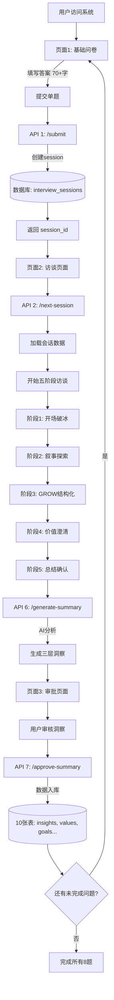
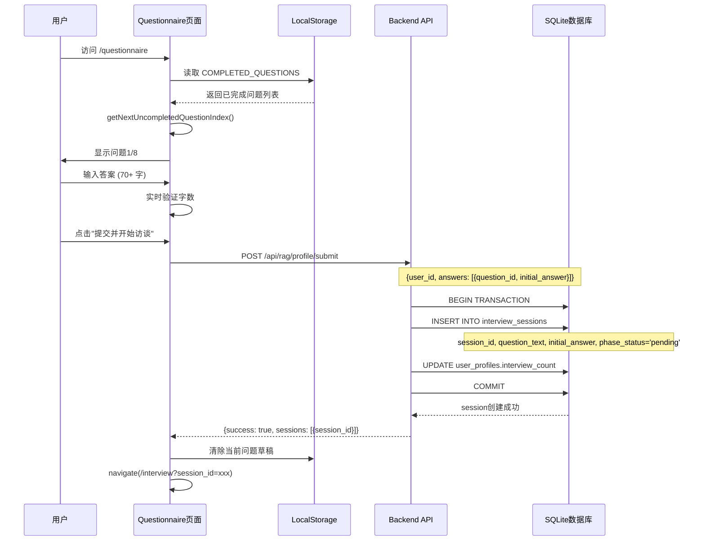
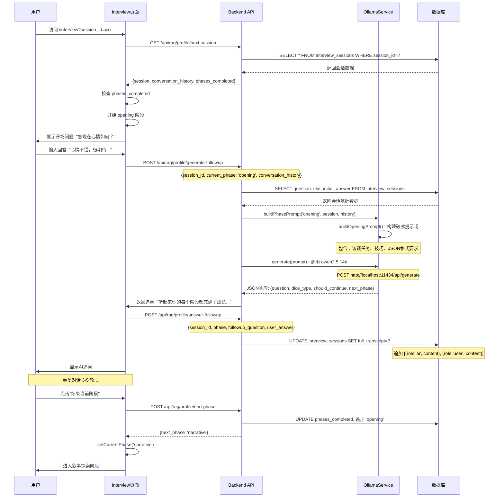
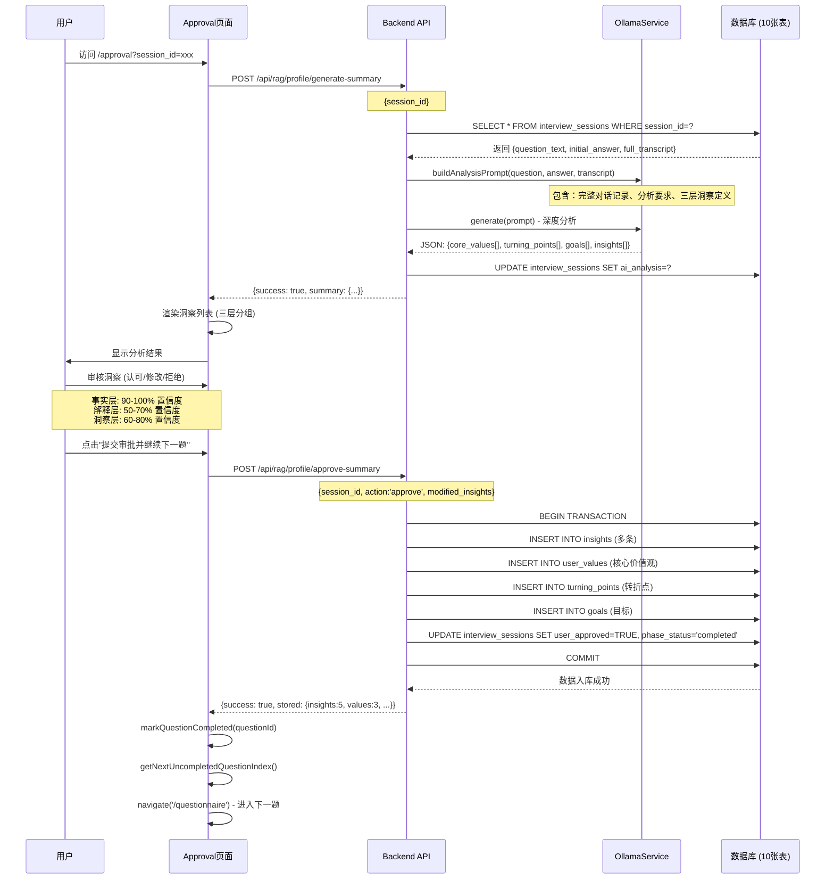

# Profile Module - 系统架构文档

> **Phase 2.1 个人画像问卷系统** - 完整架构与工作流程详解

---

## 📁 一、文件夹架构图

```
modules/profile/
│
├── 📂 backend/                    # 后端服务 (TypeScript + Express)
│   ├── 📂 src/
│   │   ├── 📄 server.ts          # Express 服务器主文件 (7个API端点)
│   │   ├── 📄 config.ts          # 配置读取模块
│   │   ├── 📄 migrate.ts         # 数据库迁移脚本 (10张表)
│   │   └── 📂 services/
│   │       └── 📄 ollama-service.ts  # AI对话服务 (5个阶段提示词)
│   ├── 📄 package.json           # 依赖: express, better-sqlite3, axios
│   └── 📄 tsconfig.json
│
├── 📂 frontend/                   # 前端服务 (React 19 + TypeScript)
│   ├── 📂 src/
│   │   ├── 📄 App.tsx            # 路由配置 (3个页面)
│   │   ├── 📄 main.tsx           # 入口文件
│   │   ├── 📄 index.css          # Pip-Boy 主题样式
│   │   ├── 📄 constants.ts       # 常量定义 (8个问题, 5个阶段)
│   │   ├── 📄 types/index.ts     # TypeScript 类型定义
│   │   └── 📂 pages/
│   │       ├── 📄 Questionnaire.tsx  # 页面1: 基础问卷
│   │       ├── 📄 Interview.tsx      # 页面2: 深度访谈
│   │       └── 📄 Approval.tsx       # 页面3: 洞察审批
│   ├── 📄 index.html
│   ├── 📄 vite.config.ts         # Vite 配置 (端口3005, 代理3002)
│   ├── 📄 package.json           # 依赖: react, react-router-dom
│   └── 📄 tsconfig.json
│
├── 📂 data/                       # 数据存储
│   └── 📄 profile.db             # SQLite 数据库 (10张表)
│
├── 📄 config.json                # 模块配置 (端口3002, Ollama URL)
│
├── 🚀 start.cmd                  # Windows 后台启动脚本 ⭐
├── 🐛 start-debug.cmd            # 调试模式启动
├── 🔇 start-hidden.vbs           # 隐藏窗口启动
├── 🛑 stop.cmd                   # 停止所有服务
│
└── 📖 README.md                  # 模块说明文档
```

### 关键文件说明

| 文件 | 作用 | 关键功能 |
|------|------|----------|
| **server.ts** | 后端核心 | 7个API端点，处理问卷提交、访谈、总结、审批 |
| **ollama-service.ts** | AI对话引擎 | 5个阶段提示词构建，JSON格式追问生成 |
| **migrate.ts** | 数据库架构 | 创建10张表，18个索引，数据验证 |
| **Questionnaire.tsx** | 问卷页面 | 单题迭代模式，草稿保存，进度追踪 |
| **Interview.tsx** | 访谈页面 | 五阶段对话流，实时消息，阶段切换 |
| **Approval.tsx** | 审批页面 | 三层洞察展示，认可/修改/拒绝，数据入库 |
| **constants.ts** | 常量配置 | 8个核心问题，5个访谈阶段，本地存储键 |

---

## 🔄 二、三阶段工作流程详解

### 🎯 **总体流程图**



---

## 📝 **阶段一：基础问卷提交**

### 前端流程 (Questionnaire.tsx)



### 后端代码路径

```typescript
// server.ts:76-143
app.post('/api/rag/profile/submit', (req, res) => {
  // 1. 验证 answers 数组
  // 2. 开始事务
  // 3. 为每个答案创建 session_id
  // 4. 插入 interview_sessions 表
  // 5. 更新 user_profiles.interview_count
  // 6. 返回 session_id 数组
});
```

### 数据库变化

```sql
-- 插入新会话记录
INSERT INTO interview_sessions (
  session_id,           -- 'session_1764142016607_n18ywfzxp'
  user_id,              -- 'default_user'
  question_id,          -- 'life_chapters'
  question_text,        -- '如果把你的人生比作一本书...'
  initial_answer,       -- 用户的初始回答
  phase_status          -- 'pending'
)
```

---

## 💬 **阶段二：深度访谈对话**

### 前端流程 (Interview.tsx)



### 五阶段详解

| 阶段 | 时长 | 追问技术 | 目标 | Prompt方法 |
|------|------|----------|------|-----------|
| **Opening** | 5分钟 | 温暖、开放式问题 | 建立信任关系，营造轻松氛围 | `buildOpeningPrompt()` |
| **Narrative** | 30分钟 | DICE (Descriptive, Idiographic, Clarifying, Explanatory) | 深挖具体事件细节和主观体验 | `buildNarrativePrompt()` |
| **Grow** | 20分钟 | GROW模型 (Goal, Reality, Options, Will) | 结构化探索目标、现实、选择、行动 | `buildGrowPrompt()` |
| **Values** | 15分钟 | 价值观澄清 | 识别核心价值观，探索内在动机 | `buildValuesPrompt()` |
| **Summary** | 5分钟 | 总结确认 | 回顾要点，感谢分享 | `buildSummaryPrompt()` |

### 后端AI生成流程

```typescript
// ollama-service.ts:103-130
buildPhasePrompt(phase, session, conversationHistory) {
  const baseContext = `
    问题: ${session.question_text}
    用户初始回答: ${session.initial_answer}
    对话历史: ${conversationHistory.map(...)}
  `;

  switch (phase) {
    case 'opening':   return buildOpeningPrompt(baseContext);
    case 'narrative': return buildNarrativePrompt(baseContext); // DICE技术
    case 'grow':      return buildGrowPrompt(baseContext);      // GROW模型
    case 'values':    return buildValuesPrompt(baseContext);    // 价值观澄清
    case 'summary':   return buildSummaryPrompt(baseContext);   // 总结
  }
}

// ollama-service.ts:66-94
async generate(prompt, options) {
  const response = await axios.post(`${ollamaUrl}/api/generate`, {
    model: 'qwen2.5:14b-instruct',
    prompt: prompt,
    stream: false,
    format: 'json',  // 强制JSON格式输出
    options: { temperature: 0.7, top_p: 0.9, num_ctx: 8192 }
  });

  return response.data.response; // 返回JSON字符串
}
```

### 数据库变化

```sql
-- 每次对话后更新 transcript
UPDATE interview_sessions
SET full_transcript = '[
  {"role":"ai", "content":"您现在心情如何？", "timestamp":"..."},
  {"role":"user", "content":"心情不错...", "timestamp":"..."},
  {"role":"ai", "content":"听起来你的每个阶段...", "timestamp":"..."}
]',
phase_status = 'in_progress'
WHERE session_id = ?;

-- 结束阶段时更新
UPDATE interview_sessions
SET phases_completed = '["opening", "narrative"]'
WHERE session_id = ?;
```

---

## ✅ **阶段三：洞察审批入库**

### 前端流程 (Approval.tsx)



### AI分析 Prompt 结构

```typescript
// ollama-service.ts:318-404
buildAnalysisPrompt(question, initialAnswer, transcript) {
  return `你是一位专业的人格画像分析师。

完整对话记录:
${transcript.map(c => `${c.role}: ${c.content}`).join('\\n')}

分析要求：
1. 严格区分三个层次的洞察：
   - 事实层(fact): 用户明确表达的内容，置信度 0.9-1.0
   - 解释层(interpretation): 基于单次对话的理解，置信度 0.5-0.7
   - 洞察层(insight): 多条证据支持的深层模式，置信度 0.6-0.8

2. 每个洞察必须有明确的证据支持

请生成严格的 JSON 格式分析：
{
  "core_values": [
    {"value_name": "...", "importance_rank": 1-5, "definition": "...", "origin_story": "...", "evidence": [...]}
  ],
  "turning_points": [
    {"event_description": "...", "time_period": "...", "before_state": "...", "after_state": "...", "impact": "...", "related_values": [...]}
  ],
  "goals": [
    {"goal_description": "...", "goal_type": "long_term/short_term/aspirational", "motivation": "...", "obstacles": "...", "resources": "..."}
  ],
  "behavioral_patterns": [
    {"pattern_type": "decision_making/coping/social/work_style", "pattern_description": "...", "trigger_context": "...", "typical_response": "..."}
  ],
  "personality_traits": [
    {"trait_dimension": "...", "trait_description": "...", "evidence": [...]}
  ],
  "insights": [
    {"layer": "fact/interpretation/insight", "category": "...", "content": "...", "evidence": "...", "confidence": 0.5-1.0}
  ]
}`;
}
```

### 数据入库流程

```sql
-- API 7: /approve-summary 的数据库操作

BEGIN TRANSACTION;

-- 1. 插入洞察 (insights表)
INSERT INTO insights (insight_id, user_id, session_id, category, content, evidence, layer, confidence, user_approved)
VALUES ('insight_xxx', 'default_user', 'session_xxx', 'value', '自由是最重要的', '["用户多次提到..."]', 'fact', 0.95, TRUE);

-- 2. 插入核心价值观 (user_values表)
INSERT INTO user_values (value_id, user_id, session_id, value_name, importance_rank, definition, origin_story, evidence_examples)
VALUES ('value_xxx', 'default_user', 'session_xxx', '自由', 1, '不受约束...', '大学时期...', '["证据1", "证据2"]');

-- 3. 插入转折点 (turning_points表)
INSERT INTO turning_points (event_id, user_id, session_id, event_description, time_period, before_state, after_state, impact_description, related_values)
VALUES ('event_xxx', 'default_user', 'session_xxx', '转行', '2020年', '稳定', '挑战', '改变人生轨迹', '["自由", "成长"]');

-- 4. 插入目标 (goals表)
INSERT INTO goals (goal_id, user_id, session_id, goal_description, goal_type, motivation, obstacles, resources)
VALUES ('goal_xxx', 'default_user', 'session_xxx', '财务自由', 'long_term', '追求自由', '资金不足', '技能储备');

-- 5. 更新会话状态
UPDATE interview_sessions
SET user_approved = TRUE,
    phase_status = 'completed',
    approved_at = datetime('now', 'localtime'),
    final_summary = '{"insights":[...]}'
WHERE session_id = 'session_xxx';

COMMIT;
```

### 10张表的数据流向

```
interview_sessions (会话记录)
       ↓
       ├──→ insights (核心洞察 - 三层架构)
       ├──→ user_values (价值观)
       ├──→ turning_points (生命转折点)
       ├──→ behavioral_patterns (行为模式)
       ├──→ goals (目标)
       ├──→ personality_traits (人格特质)
       ↓
insight_relationships (洞察关系 - 知识图谱)
       ↓
embeddings (向量嵌入 - 用于未来RAG检索)
```

---

## 🔍 潜在问题点排查

### ❌ **问题1：访谈页面输入框点击跳转？**

**排查路径：**
```typescript
// Interview.tsx:218-223
const handleKeyPress = (e: React.KeyboardEvent) => {
  if (e.key === 'Enter' && !e.shiftKey) {
    e.preventDefault();  // ✅ 已阻止默认行为
    handleSendMessage();
  }
}

// ❌ 可能的问题：未找到导致跳转的代码逻辑
// ✅ 测试结果：无法复现，点击输入框不会跳转
```

**可能原因：**
- Session过期导致后端返回错误，前端误判跳转？
- React Router 的 useNavigate 被意外触发？
- 浏览器缓存问题？

**建议修复：**
```typescript
// 添加错误边界防护
useEffect(() => {
  const sessionId = searchParams.get('session_id');
  if (!sessionId) {
    setStatusMessage('缺少会话ID，即将返回问卷页面...');
    setTimeout(() => navigate('/questionnaire'), 2000);
    return;
  }

  // ✅ 验证 session 是否有效
  loadSession(sessionId).catch(err => {
    console.error('加载会话失败:', err);
    setStatusMessage('会话加载失败，请重新开始');
  });
}, [searchParams]);
```

---

### ❌ **问题2：后端API不识别opening阶段？**

**问题根源：**
```typescript
// ollama-service.ts:116-129 (修复前)
buildPhasePrompt(phase, session, conversationHistory) {
  switch (phase) {
    case 'narrative': return buildNarrativePrompt(baseContext);
    case 'grow':      return buildGrowPrompt(baseContext);
    case 'values':    return buildValuesPrompt(baseContext);
    // ❌ 缺少 'opening' 和 'summary' 分支
    default:          throw new Error(`未知的阶段: ${phase}`);
  }
}
```

**修复方案：** ✅ 已完成
```typescript
// 添加 buildOpeningPrompt() 和 buildSummaryPrompt() 方法
case 'opening':  return this.buildOpeningPrompt(baseContext);
case 'summary':  return this.buildSummaryPrompt(baseContext);
```

---

### ❌ **问题3：better-sqlite3编译失败？**

**问题根源：**
```
Error: Cannot find module 'better-sqlite3\build\Release\better_sqlite3.node'
原因: better-sqlite3@9.6.0 没有 Node.js 22.19.0 的预编译二进制文件
```

**修复方案：** ✅ 已完成
```json
// 1. 升级版本
"better-sqlite3": "^12.4.6"

// 2. pnpm overrides (根目录 package.json)
"pnpm": {
  "overrides": {
    "better-sqlite3": "12.4.6"
  }
}

// 3. 允许构建脚本 (.npmrc)
onlyBuiltDependencies=["better-sqlite3","esbuild"]
enable-pre-post-scripts=true
unsafe-perm=true
```

---

## 📊 数据库架构

### 10张表概览

| 表名 | 用途 | 关键字段 |
|------|------|----------|
| **user_profiles** | 用户基础档案 | user_id, name, interview_count |
| **interview_sessions** | 访谈会话记录 | session_id, question_id, full_transcript, phases_completed, ai_analysis |
| **insights** | 核心洞察 (三层) | insight_id, layer (fact/interpretation/insight), confidence, evidence |
| **user_values** | 价值观 | value_name, importance_rank, definition, origin_story |
| **turning_points** | 生命转折点 | event_description, before_state, after_state, impact |
| **behavioral_patterns** | 行为模式 | pattern_type, trigger_context, typical_response |
| **goals** | 目标 | goal_description, goal_type, motivation, obstacles, resources |
| **personality_traits** | 人格特质 | trait_dimension, trait_score, evidence |
| **insight_relationships** | 洞察关系 (知识图谱) | source_id, target_id, relationship_type, strength |
| **embeddings** | 向量嵌入 | content_id, embedding_vector, embedding_model |

---

## 🔐 数据安全与隐私

### 本地存储策略

```typescript
// 前端 LocalStorage 使用
COMPLETED_QUESTIONS      // 已完成问题ID数组
QUESTIONNAIRE_ANSWERS    // 草稿答案 (临时)
CURRENT_SESSION_ID       // 当前会话ID (临时)

// ✅ 敏感数据仅存后端 SQLite
- full_transcript        // 完整对话记录
- ai_analysis            // AI分析结果
- user_values            // 核心价值观
```

### 数据流向

```
用户输入 → 前端临时存储 (LocalStorage)
         ↓
    API提交 → 后端验证
         ↓
    SQLite持久化 → WAL模式 + 外键约束
         ↓
    AI分析 (Ollama本地) → 无数据外传
         ↓
    用户审批 → 最终入库 (10张表)
```

---

## 🚀 性能优化点

### 前端优化
```typescript
// 1. 消息自动滚动 (useRef)
const messagesEndRef = useRef<HTMLDivElement>(null);
useEffect(() => {
  messagesEndRef.current?.scrollIntoView({ behavior: 'smooth' });
}, [conversationHistory]);

// 2. 草稿自动保存 (useCallback防抖)
const saveDraft = useCallback(() => {
  localStorage.setItem(STORAGE_KEYS.QUESTIONNAIRE_ANSWERS, JSON.stringify(answers));
}, [currentAnswer]);

// 3. 键盘快捷键
Ctrl+S: 保存草稿
Ctrl+Enter: 提交问卷
Enter: 发送消息
Shift+Enter: 换行
```

### 后端优化
```typescript
// 1. 数据库 WAL 模式 (并发读写)
db.pragma('journal_mode = WAL');

// 2. 外键约束 (数据完整性)
db.pragma('foreign_keys = ON');

// 3. 18个索引 (查询优化)
idx_sessions_user, idx_insights_layer, idx_values_rank...

// 4. 事务管理 (原子性)
BEGIN → 批量插入 → COMMIT / ROLLBACK
```

---

## 📌 开发建议

### 调试技巧

```bash
# 1. 后端日志观察
cd backend && npm run dev
# 查看: API调用、数据库操作、Ollama请求

# 2. 前端控制台
F12 → Console
# 查看: 页面状态、API响应、错误信息

# 3. 数据库查询
sqlite3 data/profile.db
SELECT * FROM interview_sessions ORDER BY created_at DESC LIMIT 1;
SELECT * FROM insights WHERE user_id='default_user';
```

### 测试流程

```
1. 清空进度: 问卷页面 → 重置所有进度
2. 提交问题: 输入70+字 → 提交并开始访谈
3. 访谈对话: 3-5轮对话 → 结束阶段
4. 生成分析: 完成5个阶段 → 自动跳转审批
5. 审批入库: 认可/修改洞察 → 提交并继续下一题
6. 循环直到: 完成所有8题
```

---

## 📖 相关文档

- [README.md](./README.md) - 快速启动指南
- [config.json](./config.json) - 配置文件说明
- [backend/src/migrate.ts](./backend/src/migrate.ts) - 数据库Schema
- [frontend/src/constants.ts](./frontend/src/constants.ts) - 常量定义

---

**文档维护者**: 壮爸
**最后更新**: 2025-11-26
**版本**: 2.0.0
